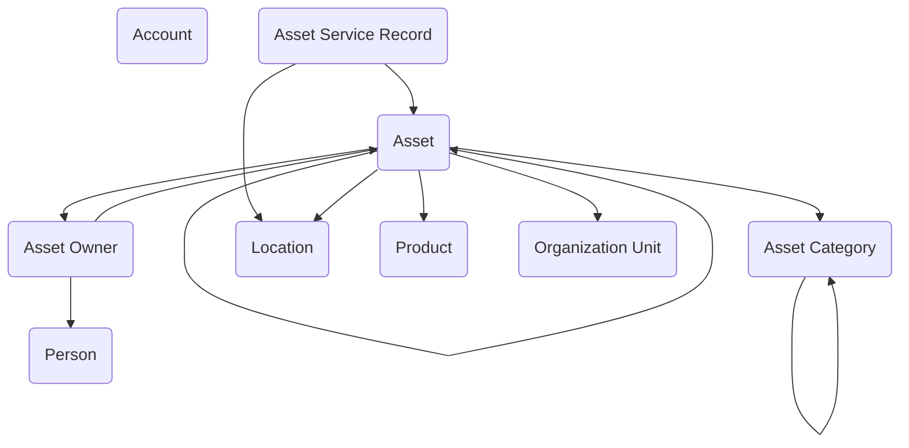

## Asset Management: Tracking Resources Across the Government Enterprise

The **Asset Management** module provides a streamlined data model for managing the physical and accountable resources that government agencies rely on to carry out their missions. From vehicles and IT equipment to specialized tools and facilities, government programs need a reliable way to track what assets exist, where they are, who is responsible for them, and how they are maintained. This module establishes that foundation in Dataverse, giving agencies a reusable structure that can stand alone or integrate with broader operational applications.

At its center is the **Asset** table, which represents any managed resource with comprehensive tracking capabilities. Each asset is classified using an **Asset Category**, allowing agencies to group items by type—such as vehicles, laptops, furniture, or laboratory equipment. Categories can support reporting, lifecycle rules, or even financial treatment, giving organizations a flexible way to differentiate between high-value assets, consumables, or controlled items. Assets are tracked through their complete lifecycle using **Asset Status** values like In Transit, In Storage, Issued, Under Maintenance, or Retired, while unique identifiers including serial numbers, service tags, and RF tags enable precise tracking and inventory management.

Responsibility for assets is modeled through the **Asset Owner** table, which links people or accounts to specific items. Owners may be individual staff, organizational units, or external partners, ensuring clear accountability no matter how the asset is managed. The **Person** and **Account** tables provide the anchor for this responsibility, while direct **Organization Unit** assignments enable institutional-level tracking. **Location** defines the physical place where the asset is housed or deployed, enhanced with location notes for detailed placement information and last inventory dates for audit trails. This combination allows agencies to answer critical questions like "Who is responsible for this item?" and "Where is it right now?"—both essential for inventory accuracy and audit readiness.

The lifecycle of an asset is tracked through **Asset Service Records**, which capture maintenance, inspections, repairs, or other service events. By recording dates, service types, and outcomes, agencies can monitor asset condition and plan for replacement or retirement. Service records also create a history that supports compliance with regulatory standards, particularly in areas like fleet management, IT security, or health and safety equipment.

In practice, this model can support a wide range of use cases with comprehensive tracking capabilities. A facilities program could use it to track building systems and their service schedules, recording purchase costs and quantities for budget management. A fleet office might use Asset Categories for vehicles, linking them to service records for oil changes, inspections, and repairs, while tracking status transitions from "In Storage" to "Issued" and tying responsibility back to specific drivers or units through Organization Unit assignments. An IT office could log laptops and mobile devices with serial numbers and service tags, connect them to their assigned users, monitor replacement cycles through service records, and maintain accurate inventory through RF tag scanning and regular inventory date updates.

By combining accountability, categorization, location tracking, service history, financial management, and comprehensive status tracking, the Asset Management module gives agencies a complete picture of their resources. It reduces duplication of effort across programs, supports better stewardship of government property, and ensures that mission-critical assets are properly maintained, assigned, and tracked throughout their lifecycle. The model supports both individual item management and bulk asset tracking with quantities and costs, while multiple identification methods (serial numbers, service tags, RF tags) ensure accurate inventory control. As with other reusable data models, it is designed to plug into larger solutions, helping agencies manage resources in context with the people, programs, and processes they support.

