## Core: A Foundation Data Model for Federal Power Platform Apps

When building government applications on the Power Platform, one of the biggest challenges is that so many projects start from scratch, even when they share the same underlying data needs. Whether you’re working on case management, grants, compliance, HR, or procurement, there is a recurring set of tables, fields, and relationships that almost every app will need. The Government Data Models – Core module is designed to solve this problem by providing a shared, reusable backbone of common entities that federal agencies can build on, saving time while improving consistency across solutions.

At its heart, the module is a curated set of Dataverse tables that cover the core concepts most government processes depend on. It brings together people and organizational data, legal and compliance references, documents and approvals, geographic and jurisdictional boundaries, program and workforce classifications, as well as risk and impact assessment structures. These are not just arbitrary tables—they have been shaped with government data patterns in mind, including the need for historical tracking, reference code alignment with federal standards, and secure handling of sensitive information.

For example, the module’s Person table isn’t simply a contact list; it’s designed to handle multiple organizational assignments over time, link individuals to their competencies, track clearance levels with effective dating, and store personal information securely under field-level security rules.

To support scenarios that require capturing and classifying discrete personal data records (for applications, background checks, or other casework), the module now includes a Personal Information table and a companion Personal Information Type table. Personal Information stores individual records (for example: Name, Details, Start/End dates, Severity, Impact, Location, Person, Organization, Point of Contact, and related type/subtype links) so agencies can track entries over time and relate them to people, places, and actions. The Personal Information Type table provides metadata for classifying those entries (Type and Parent/Subtype relationships), enabling consistent categorization, filtering, and reporting without bloating the main Person record. The Account and Organization Unit tables can represent agencies, vendors, or grantees and the internal divisions, programs, or offices within them. On the legal side, tables such as Legal Authority, Compliance Framework, and Compliance Requirement allow agencies to tie regulations directly to the controls and evidence that demonstrate compliance, creating a living connection between statutory obligations and day-to-day operations.

Content management is also a core feature. The Document table supports versioning, storage references, and relationships to agreements, compliance requirements, or risk assessments. Signature Approval and Review Approval Decision create consistent patterns for capturing approvals and decisions across any process, whether it’s signing off on a grant award or reviewing a policy document. Geographic reference tables like Country, State or Province, Judicial District, and Location ensure that apps use standardized place data, improving reporting and interoperability.

The benefit of this approach becomes clear when you consider real-world applications. A FOIA or privacy request app could use the Person table to track requesters, the Legal Authority table to manage relevant statutes, and the Document table to store responsive records—all without creating a single new table. A grants management portal could rely on Account and Agreement for grantee relationships, Fiscal Period for reporting cycles, and Risk Item for tracking potential program issues. Even workforce planning tools can take advantage of Job Series, Grade-Rank, Competency, and Clearance Level to deliver a complete staffing view without reinventing core HR structures.

By providing this reusable set of well-designed tables and relationships, the Government Data Models – Core module does more than accelerate development. It creates a foundation that agencies can trust, knowing that the data is structured for compliance, interoperability, and future reuse. In short, it’s the common language for the many solutions that together make up a modern government’s digital ecosystem.

```mermaid
graph TD
  Account(Account)
  Contact(Person)
  govcdm_Agreement(Agreement)
  govcdm_Analysis(Analysis)
  govcdm_clearancelevel(Clearance Level)
  govcdm_Competency(Competency)
  govcdm_ComplianceFramework(Compliance Framework)
  govcdm_ComplianceFrameworkCategory(Compliance Framework Category)
  govcdm_ComplianceRequirement(Compliance Requirement)
  govcdm_ContentTemplate(Content Template)
  govcdm_country(Country)
  govcdm_DiscussionItem(Discussion Item)
  govcdm_Document(Document)
  govcdm_fiscalperiod(Fiscal Period)
  govcdm_graderank(Grade-Rank)
  govcdm_Impact(Impact)
  govcdm_jobseries(Job Series)
  govcdm_JudicialDistrict(Judicial District)
  govcdm_LegalAmendment(Legal Amendment)
  govcdm_LegalAuthority(Legal Authority)
  govcdm_LegalCrossReference(Legal Cross-Reference)
  govcdm_Location(Location)
  govcdm_organizationinitiative(Organization Initiative)
  govcdm_organizationunit(Organization Unit)
  govcdm_organizationunittype(Organization Unit Type)
  govcdm_paygrade(Pay Grade)
  govcdm_PersonalInformation(Personal Information)
  govcdm_PersonalInformationType(Personal Information Type)
  govcdm_personneltype(Personnel Type)
  govcdm_PrivacyConsent(Privacy Consent)
  govcdm_Product(Product)
  govcdm_reviewapprovaldecision(Review Approval Decision)
  govcdm_RiskItem(Risk Item)
  govcdm_SignatureApproval(Signature Approval)
  govcdm_stateorprovince(State or Province)
  SystemUser(User)
  govcdm_Agreement --> Account
  govcdm_ComplianceFramework --> Account
  govcdm_Product --> Account
  govcdm_LegalAuthority --> Account
  govcdm_PersonalInformation --> Account
  govcdm_Analysis --> Contact
  govcdm_SignatureApproval --> Contact
  govcdm_organizationunit --> Contact
  govcdm_PersonalInformation --> Contact
  govcdm_PersonalInformation --> Contact
  govcdm_reviewapprovaldecision --> Contact
  govcdm_SignatureApproval --> FileAttachment
  govcdm_Impact --> govcdm_Analysis
  govcdm_RiskItem --> govcdm_Analysis
  Contact --> govcdm_clearancelevel
  govcdm_Competency --> govcdm_Competency
  govcdm_ComplianceFrameworkCategory --> govcdm_ComplianceFramework
  govcdm_ComplianceRequirement --> govcdm_ComplianceFramework
  govcdm_ComplianceRequirement --> govcdm_ComplianceFrameworkCategory
  govcdm_ComplianceRequirement --> govcdm_ComplianceRequirement
  govcdm_Document --> govcdm_ContentTemplate
  Contact --> govcdm_country
  govcdm_Location --> govcdm_country
  govcdm_stateorprovince --> govcdm_country
  govcdm_DiscussionItem --> govcdm_DiscussionItem
  govcdm_LegalAmendment --> govcdm_Document
  govcdm_LegalAuthority --> govcdm_Document
  Contact --> govcdm_graderank
  govcdm_Impact --> govcdm_Impact
  Contact --> govcdm_jobseries
  govcdm_Analysis --> govcdm_LegalAuthority
  govcdm_ComplianceFramework --> govcdm_LegalAuthority
  govcdm_Impact --> govcdm_LegalAuthority
  govcdm_LegalAmendment --> govcdm_LegalAuthority
  govcdm_LegalCrossReference --> govcdm_LegalAuthority
  govcdm_LegalCrossReference --> govcdm_LegalAuthority
  govcdm_RiskItem --> govcdm_LegalAuthority
  govcdm_Location --> govcdm_Location
  govcdm_PersonalInformation --> govcdm_Location
  govcdm_organizationinitiative --> govcdm_organizationinitiative
  govcdm_Analysis --> govcdm_organizationunit
  govcdm_Competency --> govcdm_organizationunit
  govcdm_Impact --> govcdm_organizationunit
  govcdm_organizationinitiative --> govcdm_organizationunit
  govcdm_organizationunit --> govcdm_organizationunit
  govcdm_RiskItem --> govcdm_organizationunit
  govcdm_organizationunit --> govcdm_organizationunittype
  govcdm_graderank --> govcdm_paygrade
  govcdm_PersonalInformation --> govcdm_PersonalInformationType
  govcdm_PersonalInformation --> govcdm_PersonalInformationType
  govcdm_PersonalInformationType --> govcdm_PersonalInformationType
  Contact --> govcdm_personneltype
  govcdm_Product --> govcdm_Product
  govcdm_RiskItem --> govcdm_RiskItem
  Contact --> govcdm_stateorprovince
  govcdm_Location --> govcdm_stateorprovince
  govcdm_Agreement --> TransactionCurrency
  govcdm_Product --> TransactionCurrency
```

