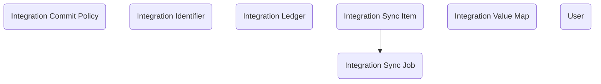

# Data Integration: A data model for record synchronization across systems

The **Data Integration** module provides a reusable framework for synchronizing and certifying data across multiple systems within Dataverse-based solutions. It begins with a small set of foundational tables that define the integration environment and mapping logic before any data exchange occurs. At the core of this foundation is the **Integration Identifier** table, which maintains the crosswalk between external system record identifiers and internal Dataverse record IDs. Each external system record is linked once to its corresponding Dataverse record, ensuring that future updates can be routed deterministically without duplication or ambiguity. This table becomes the permanent reference point for all inbound and outbound synchronization events.

Next, administrators define **Integration Commit Policy** records to establish the governance rules that control how data flows into Dataverse. These policies specify which fields or records can be updated automatically, which require certification, and which external systems are recognized as authoritative sources. Alongside this, **Integration Value Map** records are created to normalize codes and terminology from external systems into the organization’s canonical data vocabulary. Together, these setup tables—Integration Identifier, Integration Commit Policy, and Integration Value Map—provide the configuration backbone for all later synchronization activity.

Once these configurations are in place, external systems begin transmitting data through integration endpoints. Each inbound transaction is captured as an **Integration Sync Job**, serving as the batch header for a single synchronization event. Under each job, one or more **Integration Sync Items** are created to represent the individual field- or record-level updates received. As Sync Items are created, the integration process resolves their target Dataverse records using the **Integration Identifier** crosswalk and, if necessary, updates or creates Identifier rows for any new external records. Normalization is then applied through the Value Map, and Commit Policy rules determine whether updates should be written immediately (OnIngest) or held pending certification (OnCertify).

After changes are applied, provenance is recorded in the **Integration Ledger**, which maintains the long-term history and certification status for each governed aspect—whether field-level, record-level, or relationship-level. The Ledger captures the source system, status (Pending, Certified, Rejected, or Revoked), and relevant timestamps, allowing transparent tracking of where each value came from and who validated it. Over time, data stewards review pending entries, certify trusted values, and trigger updates back to source systems as needed. Each Sync Job concludes with a final status, providing a complete audit trail from source event through certification.

In this model, setup tables define enduring configuration and mappings, while the ongoing processing tables record and manage synchronization events. Together, they provide a coherent, reusable data integration framework that delivers both operational automation and governance across any Dataverse solution, ensuring consistent, trustworthy, and traceable data flows.

