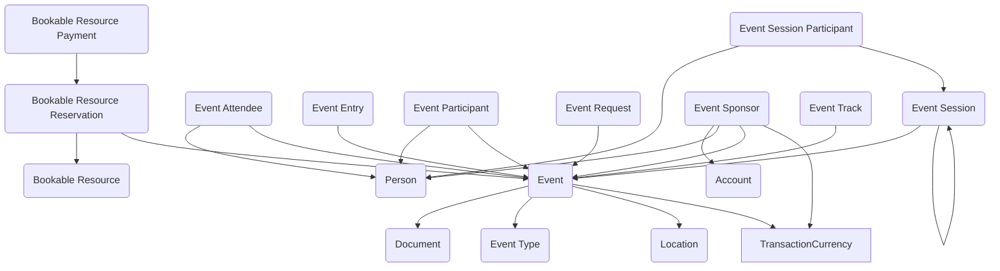

## Event Management: A Data Model for Planning and Coordinating Activities

The **Event Management** module provides a flexible structure for agencies to plan, schedule, and manage events of all kinds - from multi-day conferences with sponsors and tracks to training sessions, public meetings, and internal workshops. Events are a routine part of government operations, yet they often require coordinating people, places, resources, funding, and complex schedules in a way that can quickly become overwhelming. This module brings those pieces together in Dataverse, creating a consistent framework for tracking who is attending, what resources are needed, how costs are managed, and how events are structured.

At the center of the model is the **Event** table, which represents a single scheduled activity with expanded metadata including funding tracking, registration management, document management, and categorization. Events can be organized by **Event Type** and **Event Category**, with support for registration windows, commitment tracking, and document management including agendas, terms and conditions, FAQs, and volunteer information.

The model supports sophisticated attendee and participant management through multiple specialized tables. **Event Attendees** track general registrations and attendance, while **Event Participants** capture more specific roles like speakers, judges, and presenters. For complex events, **Event Sessions** allow breaking events into smaller components like workshops or presentations, with **Event Session Participants** tracking who is involved in each session. **Event Tracks** provide thematic organization for large conferences with multiple concurrent sessions.

Resource management remains a key feature with **Bookable Resources** representing rooms, equipment, or other assets needed to support events. Through **Bookable Resource Reservations**, these resources can be scheduled against specific events, and **Bookable Resource Payments** handle associated costs and fees.

Financial management is enhanced with **Event Sponsors** tracking organizational funding, including currency support for international events. The Event table itself includes funding fields to track available budgets, remaining funds, and actual usage, providing financial oversight for event planning and execution.

In practice, this module can support scenarios like multi-day government conferences with sponsors, tracks, sessions, and multiple participants, while still handling simple internal meetings. A training office could organize certification programs with multiple sessions, track speaker participation, manage sponsor funding, and handle resource reservations all within one cohesive system. Public engagement offices can manage large community events with various participant types, document requirements, and funding sources.

By combining events, attendees, participants, sessions, sponsors, and resources into a unified structure, the Event Management module helps agencies coordinate activities more effectively while maintaining visibility into costs, participation, and resource utilization. It delivers a scalable foundation that grows from simple meetings to complex multi-day events while maintaining consistency across the enterprise.

