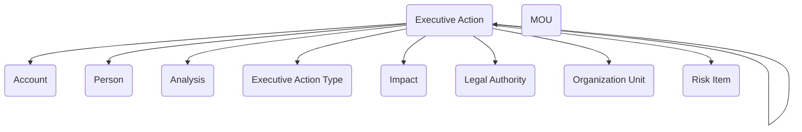

## Executive Coordination: Managing Taskers and Directives Across the Enterprise

The **Executive Coordination** module provides agencies with a structured way to manage the flow of high-level directives, taskers, and formal actions that often cut across multiple programs and offices. Senior leadership decisions rarely stay within a single unit; they cascade into action items, require coordination with partners, and carry legal, financial, or operational implications. This module delivers a data model that captures those executive actions, the context behind them, and the impacts they create, giving agencies a repeatable framework for coordination and oversight.

At the center of the model is the **Executive Action** table, which represents a directive, tasker, or formal action issued by leadership. Each action is categorized through the **Executive Action Type** table, allowing agencies to differentiate between orders, policy directives, compliance taskers, or other formal instructions. Actions are linked to the **Person** or **Organization Unit** responsible for execution, as well as to external partners recorded in the **Account** table, ensuring that accountability and coordination are explicit.

Executive actions rarely exist in a vacuum—they are shaped by legal, operational, and risk considerations. The module connects **Legal Authority** records to actions, grounding directives in their statutory or regulatory basis. **MOU** records allow agencies to reference or create agreements that arise from directives, whether with other agencies or outside partners. To anticipate and measure outcomes, **Analysis**, **Impact**, and **Risk Item** tables are used to capture evaluations of the action’s likely effects, potential risks, and the results of follow-up reviews. This creates a holistic record of not just what was directed, but why it was issued and what it produced.

The value of this model becomes clear in practice. A leadership tasker directing an agency to implement a new policy can be captured as an Executive Action, tied to the relevant Legal Authority and categorized by type. The responsible Organization Unit is assigned, while Analysis records document cost or operational impacts. Risk Items identify areas of concern, such as resource constraints or compliance risks, and Impacts describe the expected benefits or challenges. If the directive results in a formal partnership, an MOU can be created and linked, ensuring that all related records remain connected.

By weaving together directives, responsibilities, legal context, risks, and outcomes, the Executive Coordination module provides agencies with a consistent way to plan, track, and evaluate the most important actions they take. It supports accountability by showing who is responsible for what, improves transparency by linking actions to their legal and analytical foundation, and strengthens coordination across units and partners. In short, it turns executive direction into structured data that can be acted on, monitored, and learned from.

