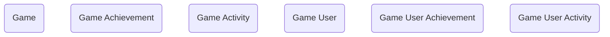

## Gamification: A Data Model for Engagement and Motivation

The **Gamification** module provides a lightweight but powerful way for agencies to encourage participation, recognize achievement, and track engagement across programs. While the federal mission is serious, many agencies have discovered that gamification techniques—such as awarding points, tracking progress, and recognizing milestones—can motivate employees, partners, or even the public to stay engaged with important initiatives. This module delivers the data model needed to support those scenarios in Dataverse, offering a reusable framework for game-style tracking and recognition.

At the core is the **Game** table, which represents a structured program or competition. Each game is defined by the set of activities participants can complete and the achievements they can earn. **Game Activities** are the individual actions or behaviors that the program wants to encourage, such as submitting reports on time, completing training, attending events, or engaging in collaboration. **Game Achievements** represent milestones or rewards, ranging from “First Submission” to “Top Performer of the Month.”

Participation is captured through the **Game User** table, which represents the individual players. These could be employees, contractors, students, or community members, depending on the program. As players engage, **Game User Activities** record their actions against the defined Game Activities, while **Game User Achievements** track the badges, points, or awards they have earned. Together, these records create a clear picture of engagement over time, allowing agencies to monitor not only who is participating but also how they are progressing toward program goals.

In practice, this module can be applied in many ways. An agency could use it internally to encourage staff to complete required training modules, awarding achievements for early completion and tracking user activities across sessions. A public outreach campaign could create a game around civic engagement, with activities for attending community meetings, submitting feedback, or volunteering, and achievements for milestones like “Community Champion.” Even collaborative workspaces can benefit, with games that recognize teamwork, innovation, or contributions to shared knowledge bases.

By standardizing how games, activities, and achievements are structured, the Gamification module allows agencies to plug motivational tools into a wide range of business applications. It makes engagement visible, gives participants a sense of progress, and allows leaders to see where recognition can drive further results. Most importantly, it provides a reusable, non-intrusive model that can be extended to support any mission area where motivation and recognition play a role.

