## HR Administration: A Data Model for Workforce Actions and Personnel Management

The **HR Administration** module provides a comprehensive structure for managing the personnel actions, requests, and events that make up the day-to-day administration of a federal workforce. Beyond hiring and payroll, federal HR programs handle a wide range of processes—from position management and leave requests to disciplinary actions and accommodations. This module delivers a standardized way to capture those activities in Dataverse, creating a foundation that can integrate with case management, time and attendance, or security solutions across government.

The model begins with core workforce entities: **Person**, **User**, **Organization Unit**, **Location**, **Job Series**, and **Grade-Rank**. Together these tables establish who an employee is, where they work, what position series they belong to, and what grade or rank they hold. Building on that, the **HR Position** and **HR Position Assignment** tables define official positions within the organization and the employees who occupy them, while the **HR Position Description** provides the authoritative record of duties, qualifications, and classification standards.

From this foundation, the module focuses on personnel actions and change management. **HR Change Request** captures requests for adjustments—such as reassignments, promotions, or duty location changes—typed through the **HR Action Type** table. **HR Personnel Action** then documents formal personnel actions, ensuring they are properly categorized, approved, and recorded for compliance. **HR Personnel Impact** extends this by linking actions to broader outcomes, such as organizational realignments or workforce reductions.

The module also addresses the full spectrum of HR-related requests and accommodations. Employees can submit **HR Time Off Requests**, which are detailed through **HR Time Off Details** to cover specific dates and leave categories. The model supports specialized leave programs with **HR VLTP Donation** for voluntary leave transfer. Flexible work arrangements are tracked through **HR Telework Requests**, while **HR Comp Overtime Requests** capture compensatory time and overtime approval processes.

Equally important, the module provides a structure for sensitive workforce matters. **HR Disciplinary Action** records events requiring formal corrective measures, linked to the affected Person and relevant Position Assignment. **HR Reasonable Accommodation** allows agencies to record and manage accommodations under the Rehabilitation Act, ensuring both compliance and support for the employee. Additional request types such as **HR GPC Request** reflect administrative needs tied to government purchase card usage or other HR-linked authorities. **HR Event** serves as a flexible log for notable personnel events that do not fit into predefined categories, maintaining a complete picture of an employee’s history.

In practice, this module enables agencies to centralize the wide variety of HR workflows in a consistent, auditable way. An employee requesting telework would submit an HR Telework Request, which HR staff could review alongside that person’s Position Assignment and supervisor’s Organization Unit. A disciplinary action could be tied directly to a Person, linked with an HR Personnel Action for recordkeeping, and associated with an HR Personnel Impact if it triggered additional changes. A workforce planning office could use Position Descriptions and Assignments, tied to Job Series and Grade-Rank, to analyze staffing gaps and track how change requests shift resources over time.

By capturing personnel actions, requests, and events in a unified structure, the HR Administration module gives agencies the tools to manage the workforce more effectively and transparently. It provides the flexibility needed to handle routine requests, the rigor required for formal actions, and the sensitivity essential for accommodations and disciplinary matters—all within a single, reusable data model.

```mermaid
graph TD
  Contact(Person)
  govcdm_graderank(Grade-Rank)
  govcdm_HRActionType(HR Action Type)
  govcdm_HRChangeRequest(HR Change Request)
  govcdm_HRCompOvertimeRequest(HR Comp Overtime Request)
  govcdm_HRDisciplinaryAction(HR Disciplinary Action)
  govcdm_HREvent(HR Event)
  govcdm_HRGPCRequest(HR GPC Request)
  govcdm_HRPersonnelAction(HR Personnel Action)
  govcdm_HRPersonnelImpact(HR Personnel Impact)
  govcdm_HRPosition(HR Position)
  govcdm_HRPositionAssignment(HR Position Assignment)
  govcdm_HRPositionDescription(HR Position Description)
  govcdm_HRReasonableAccommodation(HR Reasonable Accommodation)
  govcdm_HRTeleworkRequest(HR Telework Request)
  govcdm_HRTimeOffDetails(HR Time Off Details)
  govcdm_HRTimeOffRequest(HR Time Off Request)
  govcdm_HRVLTPDonation(HR VLTP Donation)
  govcdm_jobseries(Job Series)
  govcdm_Location(Location)
  govcdm_organizationunit(Organization Unit)
  SystemUser(User)
  govcdm_HRChangeRequest --> Contact
  govcdm_HRChangeRequest --> govcdm_HRPosition
  govcdm_HRTeleworkRequest --> Contact
  govcdm_HRTimeOffRequest --> Contact
  govcdm_HRChangeRequest --> Contact
  govcdm_HRChangeRequest --> Contact
  govcdm_HRChangeRequest --> Contact
  govcdm_HRChangeRequest --> Contact
  govcdm_HRChangeRequest --> Contact
  govcdm_HRDisciplinaryAction --> Contact
  govcdm_HRDisciplinaryAction --> Contact
  govcdm_HRPersonnelAction --> Contact
  govcdm_HRPersonnelAction --> Contact
  govcdm_HRPositionAssignment --> Contact
  govcdm_HRVLTPDonation --> Contact
  govcdm_HRVLTPDonation --> Contact
  govcdm_HRVLTPDonation --> Contact
  govcdm_HRChangeRequest --> govcdm_graderank
  govcdm_HRChangeRequest --> govcdm_graderank
  govcdm_HRChangeRequest --> govcdm_HRActionType
  govcdm_HRPersonnelAction --> govcdm_HRActionType
  govcdm_HRPersonnelAction --> govcdm_HRChangeRequest
  govcdm_HRChangeRequest --> govcdm_HRActionType
  govcdm_HRPositionAssignment --> govcdm_HRPosition
  govcdm_HRPosition --> govcdm_HRPositionDescription
  govcdm_HRTimeOffDetails --> govcdm_HRTimeOffRequest
  govcdm_HRChangeRequest --> govcdm_jobseries
  govcdm_HRChangeRequest --> govcdm_jobseries
  govcdm_HRChangeRequest --> govcdm_Location
  govcdm_HRChangeRequest --> govcdm_Location
  govcdm_HRChangeRequest --> govcdm_organizationunit
  govcdm_HRChangeRequest --> govcdm_organizationunit
  govcdm_HRPosition --> govcdm_organizationunit
```

