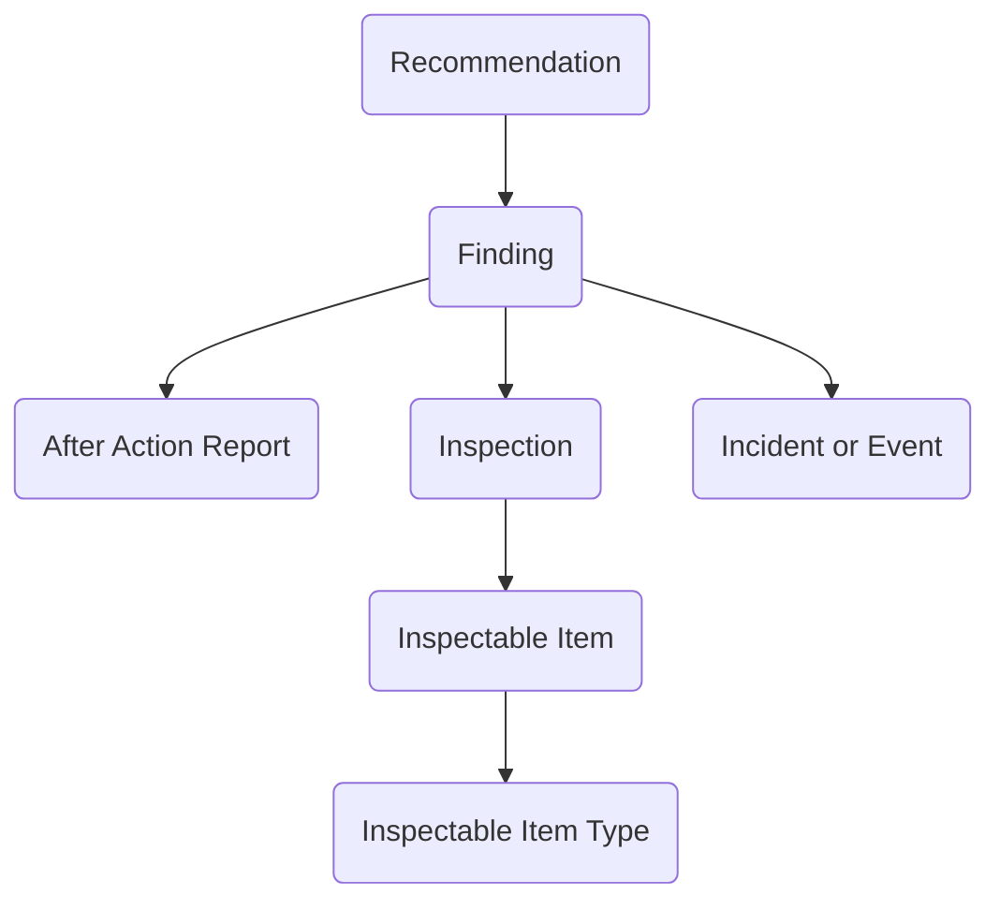

## Incidents and Inspections: A Data Model for Oversight and Response

The **Incidents and Inspections** module provides a structured way for agencies to capture, investigate, and follow up on both unexpected events and planned oversight activities. Whether dealing with a workplace accident, a facility inspection, or a program audit, agencies need to track what happened, what was found, and what corrective actions were recommended. This module brings those elements together in Dataverse, offering a reusable framework that supports transparency, accountability, and continuous improvement.

At the core of the model is the **Incident or Event** table, which represents an occurrence that needs to be recorded and analyzed. Incidents may be safety-related, operational, or even programmatic, and they serve as the anchor for related findings and corrective actions. When incidents or events trigger formal reviews, the **After Action Report** table provides a structured summary of the analysis, lessons learned, and next steps.

Planned oversight activities are captured through the **Inspection** table. Inspections focus on specific **Inspectable Items**, which can range from facilities and equipment to processes and programs. The **Inspectable Item Type** table classifies these items—for example, as vehicles, laboratories, or IT systems—allowing agencies to tailor inspections based on the type of asset or activity under review.

Both incidents and inspections may result in **Findings**, which describe problems, deficiencies, or risks that have been identified. Findings serve as the critical link between what was observed and what needs to change. To support improvement, **Recommendations** are created to propose corrective actions or preventive measures. Recommendations can then be tracked through implementation, ensuring that issues identified during incidents or inspections are not only documented but resolved.

In practice, this module can be applied in many contexts. A safety office might record an Incident when an accident occurs, attach an After Action Report summarizing the review, log Findings such as equipment failures, and issue Recommendations for procedural changes. A regulatory unit could schedule routine Inspections of facilities, classify Inspectable Items by type, and document Findings and Recommendations for compliance follow-up. Even program oversight bodies can use the same framework to capture performance inspections and track corrective actions across initiatives.

By linking incidents, inspections, findings, and recommendations in a single structure, the Incidents and Inspections module enables agencies to respond to problems, monitor oversight, and ensure follow-through on corrective actions. It creates a reusable backbone for risk management and accountability, while providing the flexibility to adapt to different missions and oversight environments. In short, it helps agencies close the loop between identifying issues and making lasting improvements.

