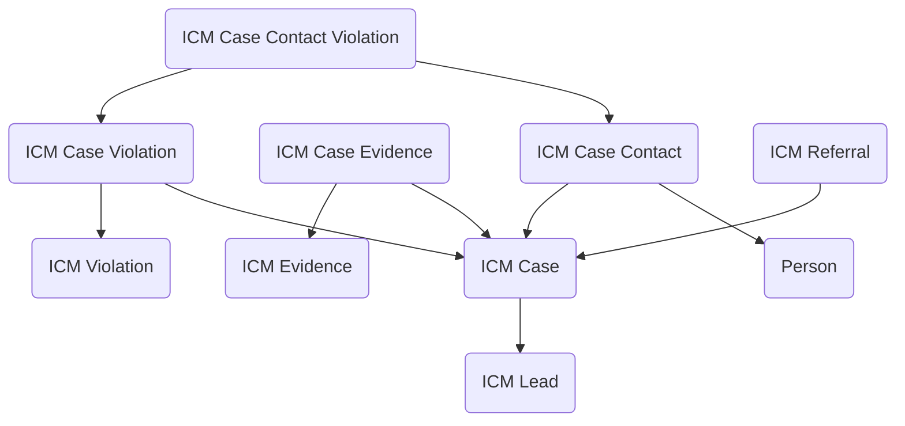

## Investigations: A Data Model for Case Management and Enforcement

The **Investigations** module delivers a structured way to manage investigative casework in government, from the first lead or referral through case development, evidence gathering, and violation tracking. Whether an agency is responsible for compliance oversight, law enforcement, or internal investigations, the need is the same: to manage sensitive information in a disciplined, auditable way while maintaining flexibility to handle a wide variety of case types. This module provides that foundation in Dataverse, aligning people, evidence, and violations under a unified case record.

The centerpiece of the model is the **ICM Case** table, which represents an individual investigation. Each case can be linked to a **Person** who is either the subject of the investigation or otherwise involved, and to one or more **ICM Leads** or **ICM Referrals** that initiated the inquiry. Leads may come from internal tips, automated monitoring, or partner agencies, while referrals formalize incoming requests from outside organizations. By linking them all back to the case record, agencies can maintain a clear chain of origin for every investigation.

Within a case, investigators often need to track multiple points of contact, evidence items, and potential violations. **ICM Case Contact** records identify individuals associated with the case, such as witnesses, complainants, or subjects, and their specific roles. When contacts themselves are connected to potential wrongdoing, **ICM Case Contact Violations** allow those details to be recorded in structured form. Evidence is managed through **ICM Case Evidence**, which links the case to specific items stored in the **ICM Evidence** table. This separation ensures that evidence can be cataloged once and then reused across multiple cases if relevant, while maintaining chain-of-custody and audit history.

Violations are treated with equal care. The **ICM Violation** table serves as the master list of defined violation types—such as regulatory breaches, criminal offenses, or policy noncompliance. Within each investigation, **ICM Case Violations** capture the specific alleged or confirmed violations tied to the case, linked to the relevant contacts, evidence, and statutory authority. This design enables agencies to analyze violation patterns across cases while preserving the detail necessary for legal and administrative actions.

In practice, the module supports a wide variety of investigative workflows. A compliance oversight office might create a case when an audit referral identifies irregularities, then attach evidence records, log interviews as case contacts, and document violations against applicable statutes. An inspector general’s office could track tips as leads, elevate them into formal cases when warranted, and build a body of evidence as the investigation progresses. Law enforcement or regulatory units could maintain violation records for reporting to prosecutors, while reusing the same evidence item across multiple linked cases.

By structuring cases, people, evidence, and violations into a consistent model, the Investigations module ensures that sensitive casework is managed transparently, securely, and in a way that supports both operational needs and oversight. It reduces duplication, enforces accountability, and gives agencies a scalable foundation for investigative case management.

