## IT Service Management: A Data Model for Technology Operations and Compliance

The **IT Service Management** module provides a comprehensive, structured approach for managing the services, systems, technologies, and compliance obligations that shape the federal IT landscape. Agencies must balance day-to-day service delivery with long-term system stewardship, ensuring that technology remains secure, accredited, and aligned with federal standards. This enhanced module brings those elements together in Dataverse, creating a reusable backbone for IT support, provisioning, compliance, technology cataloging, and accreditation.

The model supports IT operations starting at the service desk. **IT Service Requests** represent user-initiated requests for assistance or access, categorized through the **IT Service Request Type** table. Requests can involve provisioning new entitlements, reporting issues, or requesting additional services. For cases where specific access is required, **IT System Access Requests** and their associated **IT System Access Details** capture the who, what, and why of system access, ensuring compliance with least-privilege principles. Completed entitlements are recorded through **IT Assigned Entitlements** and **IT Product Entitlement**, which document what systems, applications, or products a user has been granted.

At the heart of the model is a sophisticated asset and technology management framework. **IT Systems** now capture comprehensive metadata including descriptions, URLs, points of contact, lifecycle stages, operational status, criticality levels, hosting models, security classifications, API endpoints, and review schedules. Each system can be decomposed into **IT System Components** with detailed attributes for description, tags, security classification, operational status, stewardship, and parent-child relationships through the **IT System Component Type** categorization. This hierarchical approach enables agencies to model complex system architectures and track dependencies at multiple levels.

The model introduces enhanced technology cataloging through **IT Technology** and **IT Technology Type** tables, which replace and expand upon the original IT Product concept. Technologies are categorized by type (Platform/Infrastructure, Programming Language, Application Framework, Analytics/AI, Integration/API, Development/Deployment, Security/Compliance, Data Management) and linked to vendor accounts, enabling comprehensive technology portfolio management. Systems and components can reference specific technologies, creating clear visibility into the technology stack underlying each system.

Infrastructure management is supported through **IT Datacenter** associations, while hosting approaches are captured through configurable hosting model choices (On-Premises, Cloud IaaS, Cloud PaaS, Cloud SaaS, Hybrid). **IT Work Assignment Codes** provide a way to link activities back to charge codes or funding allocations, aligning IT services with budget structures and enabling cost tracking across the technology portfolio.

Compliance and accreditation remain core to the model with enhanced capabilities. The **IT System Accreditation** table records the status of systems under federal security frameworks, such as Authority to Operate (ATO), with full organizational context. Accreditation records can be tied to **Compliance Requirements** to ensure that systems are assessed against the correct controls. The **IT Compliance Assessment** table documents the results of evaluations, findings, and evidence collected across different risk levels. To manage corrective actions, **IT POAM Items** (Plans of Action and Milestones) record the steps needed to remediate gaps, creating a closed loop between compliance assessments and remediation that spans systems, components, and accreditation records.

In practice, this enhanced module can support a comprehensive range of IT management needs. A service desk can track service requests, assign entitlements, and document provisioning. System owners can maintain detailed system and component inventories with full metadata, technology dependencies, hosting details, and compliance status. Architecture teams can model system hierarchies and technology dependencies. Security teams can manage accreditation lifecycles and track POAM items through to resolution. Technology portfolio managers can maintain comprehensive catalogs of technologies, vendors, and usage patterns across the enterprise.

The IT Service Management module brings together user support, comprehensive asset tracking, technology portfolio management, and compliance oversight into one unified model. It enables agencies to see not only who has access to what, but also the complete technology stack, hosting environment, security posture, and compliance status of their systems. This creates a foundation for trustworthy, efficient, and well-governed IT operations that can scale with agency needs while maintaining security and compliance requirements.

```mermaid
graph TD
  Account(Account)
  Contact(Person)
  govcdm_ComplianceRequirement(Compliance Requirement)
  govcdm_graderank(Grade-Rank)
  govcdm_ITAssignedEntitlements(IT Assigned Entitlements)
  govcdm_ITComplianceAssessment(IT Compliance Assessment)
  govcdm_ITDatacenter(IT Datacenter)
  govcdm_ITPOAMItem(IT POAM Item)
  govcdm_ITProduct(IT Product)
  govcdm_ITProductEntitlement(IT Product Entitlement)
  govcdm_ITProvisioningRequest(IT Provisioning Request)
  govcdm_ITServiceRequest(IT Service Request)
  govcdm_ITServiceRequestType(IT Service Request Type)
  govcdm_ITSystem(IT System)
  govcdm_ITSystemAccessDetail(IT System Access Detail)
  govcdm_ITSystemAccessRequest(IT System Access Request)
  govcdm_ITSystemAccreditation(IT System Accreditation)
  govcdm_ITSystemComponent(IT System Component)
  govcdm_ITSystemComponentType(IT System Component Type)
  govcdm_ITTechnology(IT Technology)
  govcdm_ITTechnologyType(IT Technology Type)
  govcdm_ITWorkAssignmentCode(IT Work Assignment Code)
  govcdm_Location(Location)
  govcdm_organizationunit(Organization Unit)
  govcdm_personneltype(Personnel Type)
  govcdm_RiskItem(Risk Item)
  govcdm_stateorprovince(State or Province)
  govcdm_ITTechnology --> Account
  govcdm_ITAssignedEntitlements --> Contact
  govcdm_ITComplianceAssessment --> Contact
  govcdm_ITSystem --> Contact
  govcdm_ITSystem --> Contact
  govcdm_ITSystemAccessRequest --> Contact
  govcdm_ITSystemComponent --> Contact
  govcdm_ITComplianceAssessment --> govcdm_ComplianceRequirement
  govcdm_ITSystemAccessRequest --> govcdm_graderank
  govcdm_ITPOAMItem --> govcdm_ITComplianceAssessment
  govcdm_ITSystem --> govcdm_ITDatacenter
  govcdm_ITSystemComponent --> govcdm_ITDatacenter
  govcdm_ITProductEntitlement --> govcdm_ITProduct
  govcdm_ITSystemAccessDetail --> govcdm_ITProduct
  govcdm_ITSystemAccessRequest --> govcdm_ITProduct
  govcdm_ITSystemComponent --> govcdm_ITProduct
  govcdm_ITAssignedEntitlements --> govcdm_ITProductEntitlement
  govcdm_ITSystemAccessDetail --> govcdm_ITProductEntitlement
  govcdm_ITSystemAccessRequest --> govcdm_ITProductEntitlement
  govcdm_ITServiceRequest --> govcdm_ITServiceRequestType
  govcdm_ITServiceRequestType --> govcdm_ITServiceRequestType
  govcdm_ITPOAMItem --> govcdm_ITSystem
  govcdm_ITSystemAccessRequest --> govcdm_ITSystem
  govcdm_ITSystemAccreditation --> govcdm_ITSystem
  govcdm_ITSystemComponent --> govcdm_ITSystem
  govcdm_ITSystemAccessDetail --> govcdm_ITSystemAccessRequest
  govcdm_ITComplianceAssessment --> govcdm_ITSystemAccreditation
  govcdm_ITPOAMItem --> govcdm_ITSystemAccreditation
  govcdm_ITSystem --> govcdm_ITSystemAccreditation
  govcdm_RiskItem --> govcdm_ITSystemAccreditation
  govcdm_ITPOAMItem --> govcdm_ITSystemComponent
  govcdm_ITSystemAccessDetail --> govcdm_ITSystemComponent
  govcdm_ITSystemAccessRequest --> govcdm_ITSystemComponent
  govcdm_ITSystemComponent --> govcdm_ITSystemComponent
  govcdm_ITSystemComponent --> govcdm_ITSystemComponentType
  govcdm_ITSystem --> govcdm_ITTechnology
  govcdm_ITSystemComponent --> govcdm_ITTechnology
  govcdm_ITTechnology --> govcdm_ITTechnologyType
  govcdm_ITTechnologyType --> govcdm_ITTechnologyType
  govcdm_ITServiceRequest --> govcdm_ITWorkAssignmentCode
  govcdm_ITSystemAccessRequest --> govcdm_ITWorkAssignmentCode
  govcdm_ITSystemAccessRequest --> govcdm_Location
  govcdm_ITSystemAccessRequest --> govcdm_organizationunit
  govcdm_ITSystemAccreditation --> govcdm_organizationunit
  govcdm_ITSystemAccessRequest --> govcdm_personneltype
  govcdm_ITSystemAccessRequest --> govcdm_stateorprovince

```

