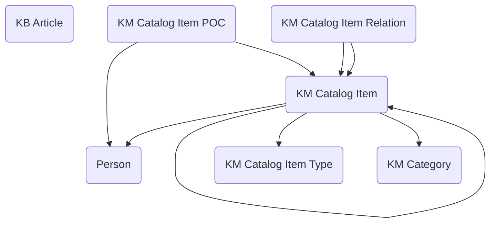

## Knowledge Management: A Data Model for Organizing and Sharing Information

The **Knowledge Management** module provides a structured framework for creating, cataloging, and maintaining knowledge resources across government programs. Agencies are under constant pressure to preserve institutional knowledge, make guidance accessible, and ensure that staff and stakeholders can quickly find the information they need. This module establishes a consistent data model in Dataverse to manage knowledge articles, catalog items, and categories, making it easier for agencies to build searchable, connected knowledge systems.

At the core of the model is the **KB Article** table, which stores the actual content—whether policy explanations, procedural guides, FAQs, or technical references. Articles can be versioned, categorized, and linked to catalog items to ensure that information is not only captured but also presented in the right context.

Supporting this, the module provides a set of cataloging tables that make knowledge resources easier to organize and navigate. **KM Catalog Items** act as structured entries that can represent services, topics, or resource areas. Each catalog item can be typed using **KM Catalog Item Type**, establishing categories such as “Service,” “Policy,” or “Technical Resource.” To enrich this structure, **KM Catalog Item Relations** allow catalog items to be connected to one another, building relationships such as “depends on,” “related to,” or “supersedes.” This creates a navigable web of knowledge, helping users move from one item to the next in a logical way.

Ownership and accountability are captured through **KM Catalog Item POC**, which designates points of contact responsible for maintaining catalog items. This ensures that every item in the knowledge catalog has an owner who can update content, respond to questions, and ensure accuracy. Finally, **KM Category** provides a way to group items into broader areas—such as Human Resources, IT Services, or Compliance—making browsing and reporting more intuitive.

In practice, this module can support a wide variety of use cases. An IT service management program might use it to organize knowledge base articles about common technical issues, linking catalog items to service request types. A human resources office could maintain a catalog of policies and procedures, with KB Articles attached to explain processes and POCs designated for each item. A compliance team might build a catalog of regulatory requirements, linking items together to show dependencies and superseding rules.

By connecting articles, catalog items, categories, and points of contact in a single model, the Knowledge Management module makes it easier for agencies to capture institutional knowledge and ensure it remains accurate and accessible. It reduces duplication, improves discoverability, and creates accountability for content ownership. Ultimately, it provides a foundation for knowledge-sharing platforms that can be tailored to the needs of any mission area while maintaining a consistent, reusable data structure.

