## Personnel Security: Managing Clearances, Investigations, and Access in Government

The **Personnel Security** module provides a comprehensive data model for managing the people, processes, and events that make up a federal agency’s security program. In government, safeguarding facilities, information, and systems depends on far more than issuing badges—it requires a coordinated set of checks, investigations, clearances, and ongoing monitoring. This module captures those activities in a consistent, auditable structure that can be used on its own or integrated with other government data models.

The foundation of the module is the **Person** table, which represents employees, contractors, visitors, or other individuals subject to security vetting. People can be linked to **Organization Units** and **Location** records, establishing where they work, what office they belong to, and where they need access. From there, the model supports the investigative and adjudicative lifecycle used by security teams.

To preserve identity and contact details across the investigative lifecycle, the module integrates with the core **Personal Information** record. A lookup from core Personal Information links back to **Personnel Background Investigation**, and the Person on a Background Investigation maps to the Person on Personal Information — enabling consistent person-level identity and investigation linkage across systems.

A new **Personnel CV Trigger** table captures continuous vetting and other trigger events (feeds, alerts, referrals) that should prompt review. Those triggers can spawn or be associated with a **Personnel Background Investigation**, which now includes a Background Investigation Type choice (for example: Initial, Reinvestigation, Continuous Evaluation, Suitability Review) to classify the investigative intent. Investigations can produce or be linked to **Personnel Clearance** records — a new table that tracks clearance status, granting authority, effective and expiration dates, and historical changes. Clearances and investigations flow into **Personnel Adjudication** where determinations, findings, and actions are recorded; field mappings and lookups are provided across these tables to keep a complete audit trail.

On the operational side, the model continues to manage access requests and credentials through **Personnel Badge Request**, **Personnel Physical Credential**, and **Personnel Visitor Request**, tying those operational events back to a person’s investigative and clearance state when necessary.

Risk detection and monitoring are supported through **Personnel Reportable Life Event**, **Personnel Foreign Contact**, and **Personnel Foreign Travel**, which capture the types of events and exposures that may affect suitability for access. To make those events more actionable, this release adds standardized choice lists such as **Intelligence Source** (to record the origin of an alert or feed) and **Personnel Security Event Type** (to categorize the nature of the event).

Finally, **Personnel Passport** keeps records of passports issued, controlled, or monitored by the agency — a necessity in organizations that sponsor official travel or manage sensitive assignments abroad.

```mermaid
graph TD
  Account(Account)
  Contact(Person)
  govcdm_Document(Document)
  govcdm_Location(Location)
  govcdm_organizationunit(Organization Unit)
  govcdm_PersonalInformation(Personal Information)
  govcdm_PersonnelAdjudication(Personnel Adjudication)
  govcdm_PersonnelBackgroundInvestigation(Personnel Background Investigation)
  govcdm_PersonnelBadgeRequest(Personnel Badge Request)
  govcdm_PersonnelClearance(Personnel Clearance)
  govcdm_PersonnelCVTrigger(Personnel CV Trigger)
  govcdm_PersonnelForeignContact(Personnel Foreign Contact)
  govcdm_PersonnelForeignTravel(Personnel Foreign Travel)
  govcdm_PersonnelPassport(Personnel Passport)
  govcdm_PersonnelPhysicalCredential(Personnel Physical Credential)
  govcdm_PersonnelReportableLifeEvent(Personnel Reportable Life Event)
  govcdm_PersonnelVisitorRequest(Personnel Visitor Request)
  SystemUser(User)
  govcdm_PersonnelBackgroundInvestigation --> Account
  govcdm_PersonalInformation --> Contact
  govcdm_PersonnelAdjudication --> Contact
  govcdm_PersonnelAdjudication --> Contact
  govcdm_PersonnelBackgroundInvestigation --> Contact
  govcdm_PersonnelBackgroundInvestigation --> Contact
  govcdm_PersonnelClearance --> Contact
  govcdm_PersonnelCVTrigger --> Contact
  govcdm_PersonnelForeignContact --> Contact
  govcdm_PersonnelForeignTravel --> Contact
  govcdm_PersonnelPassport --> Contact
  govcdm_PersonnelPhysicalCredential --> Contact
  govcdm_PersonnelPhysicalCredential --> Contact
  govcdm_PersonnelPhysicalCredential --> Contact
  govcdm_PersonnelPhysicalCredential --> Contact
  govcdm_PersonnelReportableLifeEvent --> Contact
  govcdm_PersonnelVisitorRequest --> Contact
  govcdm_PersonnelAdjudication --> govcdm_Document
  govcdm_PersonnelBackgroundInvestigation --> govcdm_Document
  govcdm_PersonnelPhysicalCredential --> govcdm_Location
  govcdm_PersonnelPhysicalCredential --> govcdm_organizationunit
  govcdm_PersonnelBackgroundInvestigation --> govcdm_PersonnelAdjudication
  govcdm_PersonnelClearance --> govcdm_PersonnelAdjudication
  govcdm_PersonalInformation --> govcdm_PersonnelBackgroundInvestigation
  govcdm_PersonnelAdjudication --> govcdm_PersonnelBackgroundInvestigation
  govcdm_PersonnelBackgroundInvestigation --> govcdm_PersonnelBackgroundInvestigation
  govcdm_PersonnelClearance --> govcdm_PersonnelBackgroundInvestigation
  govcdm_PersonnelCVTrigger --> govcdm_PersonnelBackgroundInvestigation
  govcdm_PersonnelForeignContact --> govcdm_PersonnelBackgroundInvestigation
  govcdm_PersonnelForeignTravel --> govcdm_PersonnelBackgroundInvestigation
  govcdm_PersonnelPassport --> govcdm_PersonnelBackgroundInvestigation
  govcdm_PersonnelReportableLifeEvent --> govcdm_PersonnelBackgroundInvestigation
  govcdm_PersonnelAdjudication --> govcdm_PersonnelClearance
  govcdm_PersonnelBackgroundInvestigation --> govcdm_PersonnelClearance
  govcdm_PersonnelCVTrigger --> govcdm_PersonnelClearance
  govcdm_PersonnelBackgroundInvestigation --> govcdm_PersonnelCVTrigger
```

## Requirements

Install the latest managed version of Government Data Models - Core first.

  - [Government Data Models - Core]({{ '/data-models/core/' | relative_url }})

Next, install the latest managed version of Government Data Models - Process and Tasking.

  - [Government Data Models - Process and Tasking]({{ '/data-models/process-and-tasking/' | relative_url }})