## Process and Tasking: A Data Model for Government Workflow Automation

The Process and Tasking module is designed to bring structure, visibility, and automation to complex government workflows. Many federal programs depend on repeatable processes—whether they involve onboarding staff, approving grants, reviewing compliance submissions, or managing public requests. While these processes often differ in content, they share a common pattern: a series of steps that need to be followed, tracked, and completed against specific cases, requests, or records. This module provides a standardized way to model those processes and the tasks they generate, enabling agencies to automate workflows and monitor progress across programs.

At the core of the module is the distinction between process design and process execution. Process design is captured through **Process Step** records, which define the building blocks of a workflow. These steps are grouped into process templates and can include dependencies, tools, and instructions. When a process is launched for a specific case or record—known as the primary record—those steps are instantiated as **Action Items**. **Action Items** represent the live, trackable work that needs to be completed, including due dates, status, assigned staff, and linked documents. As agencies transition to this model, the older **Action Assignment** table is being phased out in favor of the richer **Action Item** structure.

The module also includes a range of supporting tables that help make these workflows more effective and interactive. **Action Category** allows agencies to classify tasks by type or priority, improving reporting and workload balancing. **Collaboration Space** and **Discussion Item** bring people together to coordinate work, share updates, and resolve issues directly in context. For processes that require structured inputs, the module offers **Data Form**, **Data Entry Step**, and **Data Entry Response**, enabling step-specific form completion and data capture.

Interactivity is another strength of the model. **Interactive Prompt**, along with its related **Choice** and **Choice Option** tables, supports guided decision-making inside a process. These prompts can present users with branching questions or multiple-choice selections, influencing the flow of tasks that follow. **Signature Approval** integrates formal sign-off into the workflow, while **Document** and **Content Template** support document generation, review, and storage as part of the process itself.

In practice, this module is designed to work alongside other domain-specific solutions. A compliance monitoring system might define a process template for conducting an audit, with **Process Steps** for scheduling site visits, collecting evidence, reviewing findings, and issuing recommendations. Those steps would become **Action Items** tied to the specific audit record, with due dates and assignments to auditors. A public records request app could model the review and release workflow, using **Interactive Prompts** to determine whether exemptions apply, and **Signature Approval** to finalize responses. Even grant-making programs could use it to automate post-award monitoring, assigning **Action Items** for quarterly reporting, budget reviews, and site inspections.

By separating the blueprint of a process from its execution, and by giving agencies a flexible, reusable data structure for tracking work, the Process and Tasking module makes process automation not just possible but practical. It is a natural complement to other government data models, delivering the glue that connects domain-specific data to the actions and people that move work forward.

```mermaid
graph TD
  Contact(Person)
  govcdm_ActionAssignment(Action Assignment)
  govcdm_ActionCategory(Action Category)
  govcdm_ActionItem(Action Item)
  govcdm_CollaborationSpace(Collaboration Space)
  govcdm_ContentTemplate(Content Template)
  govcdm_DataEntryResponse(Data Entry Response)
  govcdm_DataEntryStep(Data Entry Step)
  govcdm_DataForm(Data Form)
  govcdm_DiscussionItem(Discussion Item)
  govcdm_Document(Document)
  govcdm_InteractivePrompt(Interactive Prompt)
  govcdm_InteractivePromptChoice(Interactive Prompt Choice)
  govcdm_InteractivePromptChoiceOption(Interactive Prompt Choice Option)
  govcdm_InteractiveResponse(Interactive Response)
  govcdm_ProcessStep(Process Step)
  govcdm_ProcessStepDependency(Process Step Dependency)
  govcdm_ProcessStepTool(Process Step Tool)
  govcdm_SignatureApproval(Signature Approval)
  SystemUser(User)
  govcdm_ActionAssignment --> Account
  govcdm_ActionItem --> Account
  govcdm_ActionAssignment --> ActivityPointer
  govcdm_ActionItem --> ActivityPointer
  govcdm_ActionAssignment --> adx_invitation
  govcdm_ActionItem --> adx_invitation
  govcdm_ActionAssignment --> Contact
  govcdm_ActionItem --> Contact
  govcdm_ActionItem --> Contact
  govcdm_DataEntryResponse --> Contact
  govcdm_InteractiveResponse --> Contact
  govcdm_DataEntryResponse --> FileAttachment
  govcdm_InteractiveResponse --> FileAttachment
  govcdm_CollaborationSpace --> govcdm_ActionAssignment
  govcdm_DiscussionItem --> govcdm_ActionAssignment
  govcdm_Document --> govcdm_ActionAssignment
  govcdm_ActionAssignment --> govcdm_ActionAssignment
  govcdm_ActionCategory --> govcdm_ActionCategory
  govcdm_ActionItem --> govcdm_ActionCategory
  govcdm_ActionItem --> govcdm_ActionCategory
  govcdm_ActionItem --> govcdm_ActionItem
  govcdm_ActionItem --> govcdm_ActionItem
  govcdm_CollaborationSpace --> govcdm_ActionItem
  govcdm_DiscussionItem --> govcdm_ActionItem
  govcdm_Document --> govcdm_ActionItem
  govcdm_ProcessStep --> govcdm_CollaborationSpace
  govcdm_ProcessStep --> govcdm_ContentTemplate
  govcdm_ProcessStepTool --> govcdm_ContentTemplate
  govcdm_ActionAssignment --> govcdm_DataEntryResponse
  govcdm_ActionItem --> govcdm_DataEntryResponse
  govcdm_DataEntryResponse --> govcdm_DataEntryResponse
  govcdm_DataEntryResponse --> govcdm_DataEntryStep
  govcdm_DataEntryStep --> govcdm_DataEntryStep
  govcdm_ProcessStep --> govcdm_DataEntryStep
  govcdm_ProcessStep --> govcdm_DataForm
  govcdm_ActionAssignment --> govcdm_Document
  govcdm_ActionItem --> govcdm_Document
  govcdm_InteractivePrompt --> govcdm_InteractivePrompt
  govcdm_InteractiveResponse --> govcdm_InteractivePrompt
  govcdm_InteractivePrompt --> govcdm_InteractivePromptChoice
  govcdm_InteractivePromptChoiceOption --> govcdm_InteractivePromptChoice
  govcdm_InteractiveResponse --> govcdm_InteractiveResponse
  govcdm_ActionItem --> govcdm_ProcessStep
  govcdm_ActionAssignment --> govcdm_ProcessStep
  govcdm_ProcessStep --> govcdm_ProcessStep
  govcdm_ProcessStep --> govcdm_ProcessStep
  govcdm_ProcessStep --> govcdm_ProcessStep
  govcdm_ProcessStepDependency --> govcdm_ProcessStep
  govcdm_ProcessStepDependency --> govcdm_ProcessStep
  govcdm_ProcessStepTool --> govcdm_ProcessStep
  govcdm_ActionItem --> govcdm_SignatureApproval
  govcdm_ActionAssignment --> govcdm_SignatureApproval
  govcdm_ActionAssignment --> InteractionForEmail
  govcdm_ActionItem --> InteractionForEmail
  govcdm_ActionAssignment --> KnowledgeArticle
  govcdm_ActionItem --> KnowledgeArticle
  govcdm_ActionAssignment --> KnowledgeBaseRecord
  govcdm_ActionItem --> KnowledgeBaseRecord
  govcdm_ActionAssignment --> Mailbox
  govcdm_ActionItem --> Mailbox
  govcdm_ActionAssignment --> mspp_adplacement
  govcdm_ActionItem --> mspp_adplacement
  govcdm_ActionAssignment --> mspp_pollplacement
  govcdm_ActionItem --> mspp_pollplacement
  govcdm_ActionAssignment --> mspp_publishingstatetransitionrule
  govcdm_ActionItem --> mspp_publishingstatetransitionrule
  govcdm_ActionAssignment --> mspp_redirect
  govcdm_ActionItem --> mspp_redirect
  govcdm_ActionAssignment --> mspp_shortcut
  govcdm_ActionItem --> mspp_shortcut
  govcdm_ActionAssignment --> mspp_website
  govcdm_ActionItem --> mspp_website
  govcdm_ActionAssignment --> SLA
  govcdm_ActionAssignment --> SLA
  govcdm_ActionItem --> SLA
  govcdm_ActionItem --> SLA

```

## Requirements

Install the latest managed version of Government Data Models - Core first.

  - [Government Data Models - Core]({{ '/data-models/core/' | relative_url }})
