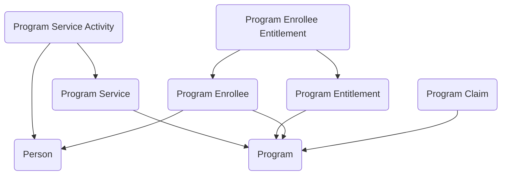

## Programs and Services: A Data Model for Benefits and Service Delivery

The **Programs and Services** module provides agencies with a structured way to manage the delivery of benefits, entitlements, and services to individuals or organizations. Many federal programs share the same core processes: enrolling participants, defining the services available, managing claims, and tracking the entitlements participants receive. This module establishes a reusable data model in Dataverse that captures those elements in a consistent, auditable way, supporting both operational needs and reporting requirements.

At the center of the model is the **Program** table, which defines the overarching initiative—such as a health benefits program, training subsidy, or assistance service. Each program can offer one or more **Program Services**, representing the specific activities, benefits, or interventions provided. Services can then be broken down into **Program Service Activities**, allowing agencies to track service delivery at a more granular level.

Participants are represented through the **Program Enrollee** table, which captures the individuals or organizations enrolled in a program. Enrollees may be granted rights or resources through **Program Entitlements**, such as eligibility for payments, vouchers, or access to specific services. To track what each enrollee actually receives, the model uses **Program Enrollee Entitlements**, which link individuals to the entitlements they have been awarded, including details like effective dates, limits, or conditions.

The model also accounts for claims, which represent requests or uses of services by enrollees. **Program Claims** are tied back to enrollees and entitlements, documenting how benefits were used or funds were disbursed. This structure provides agencies with a clear view of not only who is eligible for what, but also how entitlements are being consumed over time.

In practice, this module can support a variety of mission areas. A healthcare assistance program could record enrollees, assign entitlements for coverage, and capture claims for visits or prescriptions. A workforce training program might enroll participants, grant entitlements for tuition assistance, and track service activities such as classes attended or certifications earned. Even community service programs could use the model to manage enrollees, define services, and log activities delivered.

By linking programs, services, enrollees, entitlements, and claims into a single structure, the Programs and Services module helps agencies deliver benefits more effectively and transparently. It reduces duplication across systems, provides a clear audit trail, and ensures that entitlements and claims can be tracked consistently across participants. In short, it gives agencies a reusable foundation for managing the many ways they serve the public.

