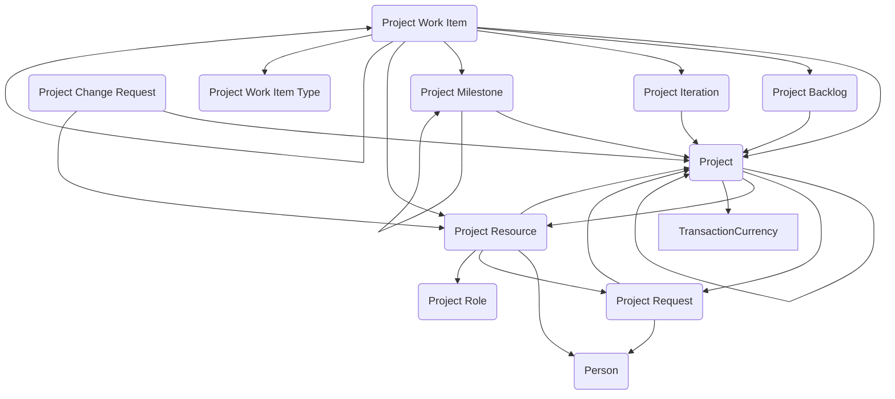

## Project Tracking: A Data Model for Managing Work, Resources, and Milestones

The **Project Tracking** module provides a flexible structure for managing projects of all shapes and sizes within government programs. Whether it’s developing a new system, conducting research, or managing a policy initiative, agencies need to track requests, allocate resources, plan iterations, and monitor progress. This module brings those elements together in Dataverse, offering a standardized framework that can adapt to agile, traditional, or hybrid project management approaches.

The core of the model is the **Project** table, which represents a defined effort or initiative. Projects can be initiated through **Project Requests**, ensuring that new work starts with a structured submission and review process. Once approved, projects can be broken down into **Project Milestones** to mark key achievements and **Project Iterations** to support phased or agile-style delivery cycles. These elements allow agencies to monitor progress against goals while maintaining flexibility in execution.

Work itself is captured through **Project Work Items**, which represent the individual tasks or deliverables that make up the project. Work Items are categorized by **Project Work Item Type**, allowing organizations to differentiate between tasks, user stories, defects, or other work structures depending on the methodology in use. The **Project Backlog** serves as the holding area for unassigned or future work items, supporting prioritization and planning before tasks are scheduled into iterations or assigned to staff.

Resource management is also built into the model. **Project Resources** represent the people, accounts, or organizational units contributing to the project, while **Project Roles** define their responsibilities. This pairing allows agencies to assign specific duties—such as project manager, analyst, or developer—and to track capacity across multiple projects. Together, these tables provide a clear view of who is involved, what they are working on, and how work is distributed.

The model also accounts for change management through the **Project Change Request** table. Change Requests document proposed adjustments to scope, schedule, or resources, capturing the rationale and decision-making process. By tying these records back to the project and its milestones, agencies can maintain transparency around how and why projects evolve over time.

In practice, this module can be used in many ways. An IT team might use it to manage a software development effort, with requests feeding the backlog, iterations defining sprints, and work items tracking stories and bugs. A policy office could manage a major initiative, using milestones to mark deliverables, change requests to handle adjustments, and roles to define contributors from across the agency. Even small operational projects benefit from the ability to capture requests, assign resources, and record accomplishments in a consistent way.

By providing a reusable structure for project planning, execution, and oversight, the Project Tracking module helps agencies bring order and accountability to their work. It supports transparency in how projects are requested, staffed, and delivered, while ensuring that the data can be reused across reporting and portfolio management systems. In short, it turns project activity into structured information that agencies can rely on to plan, track, and deliver on their missions.

