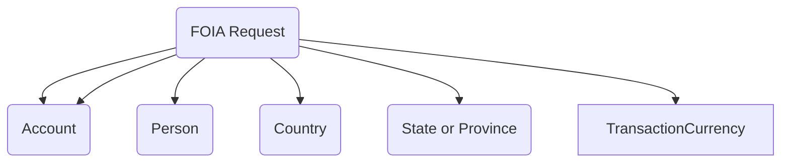

# Records Management Data Model

- Account
- Person
- Country
- FOIA Request
- State or Province

```mermaid
graph TD
  Account(Account)
  Contact(Person)
  govcdm_country(Country)
  govcdm_FOIARequest(FOIA Request)
  govcdm_stateorprovince(State or Province)
  govcdm_FOIARequest --> Account
  govcdm_FOIARequest --> Account
  govcdm_FOIARequest --> Contact
  govcdm_FOIARequest --> govcdm_country
  govcdm_FOIARequest --> govcdm_stateorprovince
  govcdm_FOIARequest --> TransactionCurrency
```
