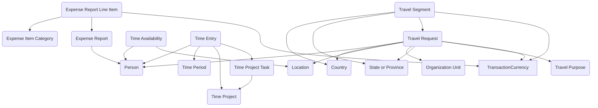

## Time, Travel, and Expenses: A Unified Model for Workforce Activity and Cost Tracking

The **Time, Travel, and Expenses** module brings together three closely related business functions into a single, reusable data model. Federal agencies often need to account for where their people are, how they are spending their time, and what costs are being incurred in the course of travel or program work. Instead of handling these areas separately in siloed applications, this module provides a coherent structure that supports workforce planning, travel approvals, and expense reporting within the same framework.

At the core of the module is the ability to track **people, places, and time**. The **Person** table represents employees or contractors, linked to **Organization Units** to establish reporting relationships. Geographic context is supplied by **Country**, **State or Province**, and **Location**, which together allow agencies to anchor time, travel, and expense data to specific jurisdictions or facilities.

For timekeeping, the module offers a flexible model that can handle both project-based and availability-based tracking. **Time Entry** records capture the hours a person spends, whether on regular work, a special project, or administrative duties. These entries are tied to **Time Periods** for reporting and to **Time Projects** and **Time Project Tasks** for allocating work against funded activities or mission objectives. The **Availability** table extends this by allowing agencies to plan ahead, recording when staff are scheduled to be available or unavailable—supporting use cases such as hybrid workplace hoteling or resource planning for field assignments.

Travel is modeled through **Travel Requests** and **Travel Segments**. A Travel Request provides the overarching purpose, destination, and approval chain for a trip, drawing from the **Travel Purpose** reference table to categorize travel consistently. Travel Segments then break the request into legs of travel, capturing details such as origin, destination, carrier, and dates. This structure supports both domestic and international trips, while keeping the data aligned with financial and compliance requirements.

Expenses are captured in **Expense Reports** and their **Line Items**. An Expense Report serves as the container for a reimbursement or payment claim, while Line Items provide the detailed breakdown of costs. Each line is categorized with an **Expense Item Category** such as lodging, transportation, per diem, or supplies. By linking Expense Reports to Time Projects, Travel Requests, or Organization Units, agencies can tie costs back to mission activities, producing a clear picture of how funds are being spent in support of operations.

The strength of this module is its ability to support multiple overlapping use cases without needing to reinvent the data model. A grants administration system might use it to capture staff time charged against funded projects. A travel management app could leverage the same tables to approve trips, break them into segments, and track associated expenses. A workforce planning tool might combine Availability and Time Entry data to forecast staffing needs across locations. Because all of these scenarios draw from the same foundation, agencies can reuse data across systems rather than reconciling it after the fact.

By unifying time, travel, and expenses into a single, extensible structure, this module gives agencies a flexible toolset to improve accountability, resource planning, and financial stewardship. It reduces duplication, enforces consistency, and creates a foundation that other mission-specific modules can build upon. In short, it helps connect the everyday activities of people to the broader programs and objectives they serve.

