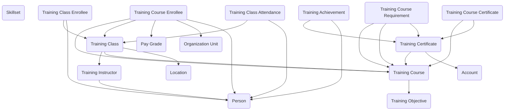

## Training and Certification: A Data Model for Workforce Development

The **Training and Certification** module provides agencies with a structured way to manage training programs, track workforce development, and issue certifications. Federal organizations need to ensure that staff and contractors possess the right skills, complete required courses, and maintain up-to-date credentials. This module captures those processes in Dataverse, linking courses, classes, enrollees, and achievements in a consistent, auditable model.

At the center of the model are **Training Courses**, which define the instructional offerings available to staff. Each course can have defined **Training Objectives**, outlining the skills or competencies to be gained, and **Training Course Requirements**, which establish prerequisites or mandatory courses for specific roles. Courses can also be linked to **Skillsets**, allowing agencies to track how training programs build capabilities across the workforce.

Delivery happens through **Training Classes**, which represent scheduled sessions of a course. Classes are tied to **Training Instructors** and can include logistical details such as dates, times, and locations. Participants are captured as **Training Class Enrollees**, and their attendance is tracked through **Training Class Attendance**. This structure allows agencies to distinguish between signing up for a course, actually attending a class, and completing the required objectives.

Achievements and credentials are central to the model. **Training Achievements** document the successful completion of a class or course, recording dates and results. Formal recognition is provided through **Training Certificates** and **Training Course Certificates**, which serve as evidence of completion or qualification. Certificates can be tied to compliance requirements, ensuring that staff maintain certifications for safety, security, or professional standards.

In practice, the module supports a variety of use cases. A cybersecurity training program could define required courses linked to specific skillsets, schedule classes with instructors, and track enrollee attendance. Upon successful completion, participants would receive achievements and certificates that satisfy compliance requirements. A professional development program could use objectives and skillsets to plan training pathways, ensuring that staff build competencies needed for promotion or specialized roles. Even mission-specific training, such as safety drills or foreign language instruction, can be managed using the same structure.

By linking courses, classes, enrollees, achievements, and certifications, the Training and Certification module provides agencies with a complete picture of workforce development. It ensures that employees receive the right training, that attendance and completion are accurately recorded, and that certifications are maintained for compliance. In short, it transforms training from a disconnected set of activities into a structured system that builds capability, readiness, and accountability across the government workforce.

