## Workplace Dispute: A Data Model for Resolution and Compliance

The **Workplace Dispute** module provides a structured way for agencies to manage employee disputes, Equal Employment Opportunity (EEO) cases, harassment claims, and alternative dispute resolution (ADR) processes. Federal agencies are required to follow clear, transparent procedures when handling workplace issues, ensuring fairness, compliance with law, and documentation for oversight. This module captures those processes in Dataverse, giving agencies a reusable framework that balances sensitivity with accountability.

The model begins with **EEO Cases** and **Harassment Cases**, which represent formal proceedings in their respective domains. Each case can include multiple **Claims**, recording the issues raised, and can be investigated through linked **Investigations**. Associated **Persons** are tracked in dedicated tables (**EEO Case Person** and **Harassment Case Person**) to record complainants, respondents, witnesses, and representatives. Outcomes are captured through **Decisions**, providing a record of findings and resolutions for each case. **EEO Inquiries** and **Harassment Inquiries** provide an entry point for early-stage matters that may or may not proceed to formal cases, ensuring that agencies can document concerns even before escalation.

Alternative dispute resolution is captured through the **ADR** set of tables. An **ADR** record represents the overall mediation or arbitration effort, while **ADR Sessions** record the specific meetings or proceedings that take place. Participants are logged through **ADR Person**, establishing who was involved, their roles, and the outcomes reached. By modeling ADR separately, agencies can document less formal resolution efforts while maintaining links to cases or grievances.

The module also includes **Grievances**, providing a structure for tracking issues raised by employees outside of the EEO or harassment process. Grievances can be managed and resolved internally, or linked to broader cases when appropriate. This ensures that all forms of workplace disputes—whether formal or informal—are captured in a consistent way.

In practice, the module supports a wide range of scenarios. An employee concern may begin as an EEO Inquiry, move forward into an EEO Case with multiple claims, and result in an Investigation followed by a Decision. A harassment complaint could be logged as a Harassment Case, with related Claims, Persons, and Investigations documented throughout the process. Alternatively, a conflict might be routed into ADR, where Sessions are recorded, and agreements documented, without escalating into formal casework. Grievances can be tracked alongside all of these processes, ensuring visibility into issues raised and addressed within the workforce.

By connecting cases, claims, investigations, decisions, and ADR processes into a single model, the Workplace Dispute module helps agencies ensure compliance with federal requirements while fostering transparency and fairness. It provides the documentation needed for oversight, the flexibility to handle cases at different levels of formality, and the sensitivity required for workplace issues. Ultimately, it gives agencies a consistent, auditable way to resolve disputes and uphold workplace integrity.

```mermaid
graph TD
  Contact(Person)
  govcdm_ADR(ADR)
  govcdm_ADRPerson(ADR Person)
  govcdm_ADRSession(ADR Session)
  govcdm_EEOCase(EEO Case)
  govcdm_EEOCaseClaim(EEO Case Claim)
  govcdm_EEOCaseDecision(EEO Case Decision)
  govcdm_EEOCaseInvestigation(EEO Case Investigation)
  govcdm_EEOCasePerson(EEO Case Person)
  govcdm_EEOInquiry(EEO Inquiry)
  govcdm_Grievance(Grievance)
  govcdm_HarassmentCase(Harassment Case)
  govcdm_HarassmentCaseClaim(Harassment Case Claim)
  govcdm_HarassmentCaseDecision(Harassment Case Decision)
  govcdm_HarassmentCaseInvestigation(Harassment Case Investigation)
  govcdm_HarassmentCasePerson(Harassment Case Person)
  govcdm_HarassmentInquiry(Harassment Inquiry)
  govcdm_Location(Location)
  govcdm_organizationunit(Organization Unit)
  govcdm_EEOInquiry --> Contact
  govcdm_EEOInquiry --> Contact
  govcdm_ADRPerson --> Contact
  govcdm_Grievance --> Contact
  govcdm_Grievance --> Contact
  govcdm_ADRPerson --> govcdm_ADR
  govcdm_ADRSession --> govcdm_ADR
  govcdm_EEOInquiry --> govcdm_Location
  govcdm_Grievance --> govcdm_Location
  govcdm_EEOInquiry --> govcdm_organizationunit
  govcdm_Grievance --> govcdm_organizationunit
```

