The **Asset Management** module provides a structured way to register, track, and govern physical assets across their full lifecycle, from acquisition through assignment, service, audit, and disposition. It provides data entry forms and views for capturing ownership and operational assignment details, maintaining custody history for accountability, logging service activity for operational visibility, and recording inventory audits and inspection requirements for compliance. Financial context can be captured through acquisition and cost tracking, while disposition records ensure defensible retirement and disposal documentation. 

Typical use cases include managing IT equipment issuance, fleet and vehicle tracking, facilities and field equipment oversight, grant-funded asset accountability, regulated inspection programs, and annual inventory verification across departments or locations.

## What's Included

Admins can establish the foundational structure by defining **Asset Categories** for high-level groupings like IT Equipment, Fleet, or Facilities Equipment, then creating **Asset Types** underneath each category to represent operational classifications such as Laptop, Vehicle, or Generator. Reference data like **Products** can be added to standardize manufacturer and model information across assets, while **Locations** capture the physical places where assets may be stored or deployed, and **Organization Units** define the departments or teams that will own or use assets. Admins can also set up **Asset Service Types** to categorize maintenance activities like Preventive, Repair, Inspection, or Upgrade.

Once the framework is in place, users can record new assets through **Asset Acquisitions**, which capture supplier information, acquisition type (purchase, lease, donation, or transfer), funding sources, and financial context for one or more incoming assets. Individual **Assets** are then registered with identifying details, current status and condition, links to Product and Asset Type, and references to their acquisition source. Each asset's legal or financial ownership can be tracked through **Asset Owners**, which support time-based ownership history with effective dates to account for leased, owned, or externally-owned scenarios.

As assets move into operational use, users can record **Asset Assignments** to track which person or organization unit has custody or responsibility for each asset over time, including start and end dates for accountability. For more detailed tracking, **Asset Custody Events** provide a timeline-based audit history of significant changes—such as assign, return, move, transfer, retire, or dispose—ensuring full visibility into asset movement and control. Additional financial context can be captured through **Asset Cost Entries**, which log capital or operational expenses like repairs, upgrades, improvements, or reconditioning to support total cost of ownership reporting.

Throughout an asset's lifecycle, users can maintain operational records through **Asset Service Records**, which log maintenance and service activities including service date, type, provider, location, cost, and notes. For regulated or compliance-driven environments, admins can define **Asset Inspection Requirements** at the Asset Type or individual Asset level, specifying recurring inspection rules, frequencies, and regulatory references. When it's time for inventory verification, admins can create **Asset Audits** to represent audit cycles or physical inventory counts, defining the scope, dates, and status, while auditors record **Asset Audit Items** for each asset reviewed, capturing expected versus observed data, verification status, and any findings or discrepancies.

Finally, when assets reach end-of-life, users can document retirement and disposal through **Asset Dispositions**, which capture retirement reason, disposal method, approval dates, recipient information (if transferred or donated), and any supporting documentation required for defensible records management and compliance.

```mermaid
graph TD
  appbase_Asset(Asset)
  appbase_AssetAcquisition(Asset Acquisition)
  appbase_AssetAssignment(Asset Assignment)
  appbase_AssetAudit(Asset Audit)
  appbase_AssetAuditItem(Asset Audit Item)
  appbase_AssetCategory(Asset Category)
  appbase_AssetCostEntry(Asset Cost Entry)
  appbase_AssetCustodyEvent(Asset Custody Event)
  appbase_AssetDisposition(Asset Disposition)
  appbase_AssetInspectionRequirement(Asset Inspection Requirement)
  appbase_AssetOwner(Asset Owner)
  appbase_AssetServiceRecord(Asset Service Record)
  appbase_AssetServiceType(Asset Service Type)
  appbase_AssetType(Asset Type)
  appbase_Location(Location)
  appbase_OrganizationUnit(Organization Unit)
  appbase_Product(Product)
  Contact(Person)
  appbase_Asset --> appbase_Asset
  appbase_AssetAssignment --> appbase_Asset
  appbase_AssetAuditItem --> appbase_Asset
  appbase_AssetCostEntry --> appbase_Asset
  appbase_AssetCustodyEvent --> appbase_Asset
  appbase_AssetDisposition --> appbase_Asset
  appbase_AssetInspectionRequirement --> appbase_Asset
  appbase_AssetOwner --> appbase_Asset
  appbase_AssetServiceRecord --> appbase_Asset
  appbase_Asset --> appbase_AssetAcquisition
  appbase_AssetAuditItem --> appbase_AssetAudit
  appbase_Asset --> appbase_AssetCategory
  appbase_AssetCategory --> appbase_AssetCategory
  appbase_Asset --> appbase_AssetOwner
  appbase_AssetServiceRecord --> appbase_AssetServiceType
  appbase_Asset --> appbase_AssetType
  appbase_AssetInspectionRequirement --> appbase_AssetType
  appbase_Asset --> appbase_Location
  appbase_AssetServiceRecord --> appbase_Location
  appbase_Asset --> appbase_OrganizationUnit
  appbase_AssetAssignment --> appbase_OrganizationUnit
  appbase_Asset --> appbase_Product
  appbase_AssetAssignment --> Contact
  appbase_AssetOwner --> Contact
  appbase_Asset --> TransactionCurrency
```

