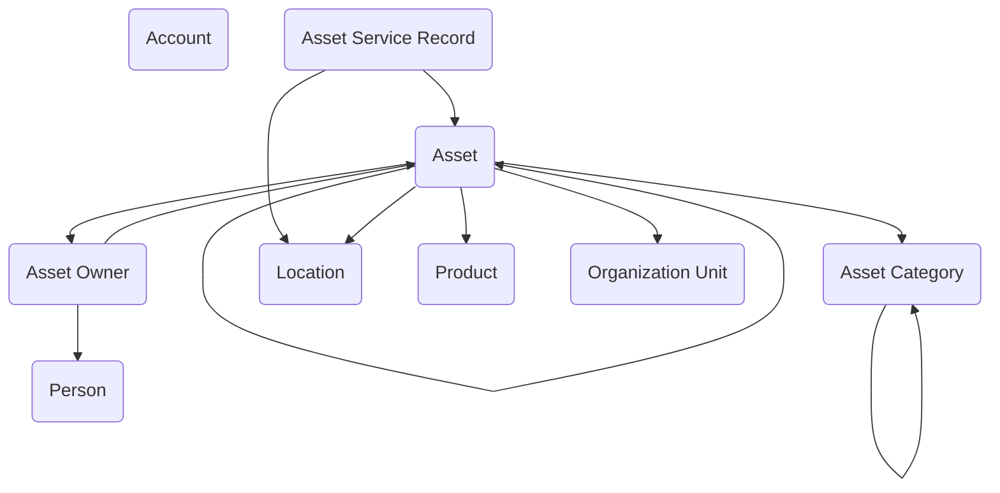

The **Asset Management** module provides a structured framework for tracking, managing, and maintaining physical and accountable assets across government organizations. Built on the Asset Management data model, it delivers a model-driven app with redesigned forms, comprehensive views, and an overview dashboard that streamline asset operations and strengthen accountability across the enterprise.

At the center of the module is the **Assets** area, which serves as the primary hub for managing the lifecycle of individual assets. The redesigned Asset form organizes information across four intuitive tabs—Asset Overview, Financials, Ownership & Location, and Notes—making it easier to register new assets, link them to categories and owners, and maintain detailed records including service history. Asset forms streamline data entry by grouping related fields logically, from identification and status tracking to financial information and location details, while preserving a clear audit trail of ownership and usage.

Supporting this are several reference areas that provide standardization and consistency across the system. **Asset Categories** allow agencies to define and manage types of assets, ensuring that classification remains uniform for reporting and compliance purposes. **Asset Owners** provide visibility into responsibility for each asset, whether assigned to individuals, teams, or external partners, with ownership changes tracked over time to maintain accountability. **Locations** capture where assets are housed or deployed, supporting logistics, field operations, and accurate inventory control.

Finally, the module includes **Service Records**, which provide a complete history of maintenance, inspections, and repairs for each asset. Users can log service events directly from the asset record, capturing dates, service types, and outcomes. This ensures that every asset carries its full maintenance record, supporting compliance with regulatory requirements and enabling agencies to plan preventive maintenance programs with confidence.

The module also includes an **Assets Overview Dashboard** that provides quick visibility into key metrics, displaying assets organized by category and status alongside an active assets list for at-a-glance operational awareness.

By bringing together assets, categories, ownership, locations, and service histories in a single system, the Asset Management module provides agencies with full visibility into the resources that support their mission while reducing duplication and improving lifecycle oversight.

## Configure the module

- Set up your Asset Categories
- Set up your Products
- Set up a few Accounts for Manufacturers
- Set up a few Persons (Contacts) for asset owners
- (Optional) Add sample Asset, Asset Owners, and Asset Service Records

## Sample data

Sample data is available for this module here - [Asset Management Sample Data](https://github.com/microsoft/gov-apptemplates/tree/main/modules/asset-management/sample-data){:target="_blank" rel="noopener noreferrer"}.

