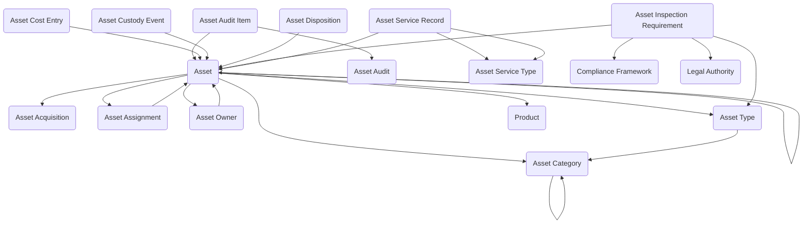

The **Asset Management** module provides a structured way to register, track, and govern physical assets across their full lifecycle, from acquisition through assignment, service, audit, and disposition. It provides data entry forms and views for capturing ownership and operational assignment details, maintaining custody history for accountability, logging service activity for operational visibility, and recording inventory audits and inspection requirements for compliance. Financial context can be captured through acquisition and cost tracking, while disposition records ensure defensible retirement and disposal documentation. 

Typical use cases include managing IT equipment issuance, fleet and vehicle tracking, facilities and field equipment oversight, grant-funded asset accountability, regulated inspection programs, and annual inventory verification across departments or locations.

## Using the Module

The module provides forms and views to capture asset information throughout the complete lifecycle from planning through disposal. Foundational reference data is established using **Asset Categories** and **Asset Types** to classify assets (e.g., IT Equipment > Laptops), **Products** to capture standard manufacturer and model information, and **Locations** and **Organization Units** to document where assets reside and which departments hold responsibility. **Asset Service Types** can be defined to categorize maintenance activities such as Preventive, Repair, Inspection, or Upgrade.

When assets are procured, **Asset Acquisition** records can document procurement details, supplier information, acquisition type (purchase, lease, donation, transfer), funding sources, and financial context for incoming assets. Individual **Asset** records capture identifying details such as serial numbers, asset tags, condition status, and links to Product and Asset Type information, along with initial cost data. Legal or financial ownership can be tracked through **Asset Owner** records, which support time-based ownership history with effective dates to account for owned, leased, or externally-owned scenarios.

The module provides separate forms to capture operational custody and movement. **Asset Assignment** records track which person or organization unit has custody or responsibility for each asset over time, including start and end dates for accountability. **Asset Custody Events** can maintain a timeline-based audit history of significant changes—such as assign, return, move, transfer, retire, or dispose—ensuring full visibility into asset movement and control. Additional financial context can be captured through **Asset Cost Entry** records, which log capital or operational expenses like repairs, upgrades, improvements, or reconditioning to support total cost of ownership reporting.

Throughout the asset's operational life, **Asset Service Records** can build a service history by referencing predefined **Asset Service Types** (Preventive Maintenance, Repair, Inspection, Upgrade), supporting maintenance planning and operational decision-making. **Asset Inspection Requirements** can be defined to document recurring compliance requirements linked to Asset Types or specific assets, including frequency and regulatory references.

The module supports periodic verification through **Asset Audit** records for inventory validation cycles, with **Asset Audit Items** documenting expected versus observed conditions at the asset level, capturing verification status and any findings or discrepancies. When assets reach end-of-life, **Asset Disposition** records can document retirement reason, disposal method, approval dates, recipient information (if transferred or donated), and supporting documentation required for defensible records management and compliance.

```mermaid
graph TD
  appbase_Asset(Asset)
  appbase_AssetAcquisition(Asset Acquisition)
  appbase_AssetAssignment(Asset Assignment)
  appbase_AssetAudit(Asset Audit)
  appbase_AssetAuditItem(Asset Audit Item)
  appbase_AssetCategory(Asset Category)
  appbase_AssetCostEntry(Asset Cost Entry)
  appbase_AssetCustodyEvent(Asset Custody Event)
  appbase_AssetDisposition(Asset Disposition)
  appbase_AssetInspectionRequirement(Asset Inspection Requirement)
  appbase_AssetOwner(Asset Owner)
  appbase_AssetServiceRecord(Asset Service Record)
  appbase_AssetServiceType(Asset Service Type)
  appbase_AssetType(Asset Type)
  appbase_ComplianceFramework(Compliance Framework)
  appbase_LegalAuthority(Legal Authority)
  appbase_Product(Product)
  appbase_Asset --> appbase_Asset
  appbase_AssetAssignment --> appbase_Asset
  appbase_AssetAuditItem --> appbase_Asset
  appbase_AssetCostEntry --> appbase_Asset
  appbase_AssetCustodyEvent --> appbase_Asset
  appbase_AssetDisposition --> appbase_Asset
  appbase_AssetInspectionRequirement --> appbase_Asset
  appbase_AssetOwner --> appbase_Asset
  appbase_AssetServiceRecord --> appbase_Asset
  appbase_Asset --> appbase_AssetAcquisition
  appbase_Asset --> appbase_AssetAssignment
  appbase_AssetAuditItem --> appbase_AssetAudit
  appbase_Asset --> appbase_AssetCategory
  appbase_AssetCategory --> appbase_AssetCategory
  appbase_AssetType --> appbase_AssetCategory
  appbase_Asset --> appbase_AssetOwner
  appbase_AssetServiceRecord --> appbase_AssetServiceType
  appbase_AssetServiceRecord --> appbase_AssetServiceType
  appbase_Asset --> appbase_AssetType
  appbase_AssetInspectionRequirement --> appbase_AssetType
  appbase_AssetInspectionRequirement --> appbase_ComplianceFramework
  appbase_AssetInspectionRequirement --> appbase_LegalAuthority
  appbase_Asset --> appbase_Product
```
