The **Core** module provides foundational entities and reference data structures used across all industry solution modules. It establishes common organizational constructs, people and workforce taxonomy, governance and decision frameworks, legal and compliance structures, risk and impact tracking, content management, and privacy consent capabilities. Rather than providing standalone business functionality, Core serves as the shared foundation that other modules extend and reference for consistent data structures, standardized classifications, and enterprise-wide reference data.

All industry solution modules depend on Core and leverage its entities to maintain organizational consistency, enable cross-module reporting, and support enterprise data governance.

## Using the Module

The module provides foundational data structures organized into several functional areas that can be referenced and extended by specialized business modules.

**Organizational Structure** is established through **Organization Units** representing departments, divisions, programs, or teams with hierarchical relationships via organization unit type assignments and parent organization unit references. **Accounts** provide external organization references for partners, vendors, or member organizations. **Locations** capture physical places (sites, buildings, rooms) with address details, country and state/province references, and location hierarchies. **Organization Initiatives** document strategic efforts, programs, or campaigns with parent initiative relationships enabling initiative portfolio management. **Judicial Districts** support government and legal scenarios with district codes, jurisdiction levels, presiding judge assignments, and state/province context.

**People and Workforce** foundations include **Person** records (from Dataverse Contact entity) representing individuals across the enterprise. **Personal Information** extends person records with sensitive data elements categorized by **Personal Information Type** with privacy controls and consent tracking. **Personnel Types** categorize workforce segments (civilian, military, contractor, volunteer) for differentiated policies and benefits. **Job Series** groups occupational families for classification and career progression. **Grade-Rank** combines grade and rank structures for hierarchical workforce systems. **Pay Grades** establish salary ranges and compensation structures. **Clearance Levels** define security clearance requirements with clearance codes and security level hierarchies. **Competencies** document skills, knowledge areas, or capabilities with competency codes and parent competency hierarchies for competency frameworks. **Credential Types** categorize certification, license, or qualification categories with parent credential type relationships and competency linkages. **Credential Assignments** link persons to credential types with issue/expiration/renewal dates, certification status, credential numbers, and supporting documents.

**Governance and Decisions** capabilities include **Agreements** documenting formal commitments, contracts, MOUs, or partnership arrangements with agreement type and status, counterparty organizations, effective and expiration dates, key terms, primary contacts, total value with currency support, and parent agreement hierarchies for master agreements and amendments. **Formal Decisions** capture official decisions with decision type, decision date, effective date, decision maker references, decision rationale, approval status, related organization initiatives, and supporting documents for governance audit trails. **Discussion Items** maintain meeting agenda items or policy discussion topics with parent discussion item threading, formal decision linkages when discussions result in decisions, and discussion context. **After Action Reports** document event retrospectives with event and report dates, report numbers, executive summaries, what went well narratives, areas for improvement, recommendations, overall assessments, report authors, organization unit attribution, related initiatives, and supporting documents for continuous improvement.

**Legal and Compliance** structures provide **Legal Authorities** capturing statutes, regulations, executive orders, policies, or legal instruments with authority type and status, citations, document numbers, jurisdiction levels, effective/enactment/expiration dates, issuing authority and body references, full text URLs, summaries, disposition notes, and parent legal authority hierarchies. **Legal Amendments** track changes to legal authorities with amendment numbers and dates, effective dates, changes summaries, legal authority impact indicators, and original authority references. **Legal Cross-References** document relationships between legal authorities with relationship type, impact indicators, and bidirectional authority references. **Compliance Frameworks** define regulatory, policy, or standard frameworks (FISMA, NIST, ISO, etc.) with framework codes, categories, versions, issuing organizations, publication status, effective dates, scope descriptions, parent framework hierarchies, and supporting documents. **Compliance Framework Categories** organize frameworks into taxonomic groupings with category codes and parent category relationships. **Compliance Requirements** detail specific compliance obligations with requirement numbers, compliance frameworks and categories, legal authority references, control objectives, compliance status, priority, responsible organization units, and parent requirement hierarchies.

**Risk and Impact** tracking enables **Risk Items** documenting threats, vulnerabilities, or uncertainties with risk descriptions, likelihood and impact ratings, risk status, mitigation strategies, owners, parent risk hierarchies for risk breakdown structures, and analysis linkages. **Impacts** capture consequences or effects with impact descriptions, impact types, severity assessments, status tracking, affected parties, risk item associations, and analysis references. **Analysis** records provide analytical studies with analysis numbers and dates, conducted by attributions, findings and recommendations, action status, general category classification, owning organization units, and supporting documents, with bidirectional links to associated risks and impacts.

**Content and Documentation** management provides **Documents** as a central document repository with document numbers, titles, versions, file attachments, publication status, effective dates, security classification, visibility controls, and document type categorization. **Content Templates** maintain reusable content patterns with template content, versions, effective dates, general category classification, and descriptions for standardized document generation.

**Privacy** capabilities include **Privacy Consents** documenting individual consent for data processing with consent type, consent status, consent date, expiration date, purpose, scope, withdrawal date, person references, and supporting consent documents for GDPR, CCPA, or similar privacy regulation compliance.

**Products** are supported through **Product** records (from Dataverse Product entity) representing goods, services, or standard items that can be referenced by procurement, asset management, inventory, or service delivery modules with parent product hierarchies for product families and variants.

**Geographic** references include **Countries** with country names and abbreviations, and **States or Provinces** with names, abbreviations, and country associations for address standardization and location management.

**Fiscal** structures provide **Fiscal Periods** representing budgetary timeframes (quarters, years) with start/end dates and parent fiscal period hierarchies for multi-level fiscal calendars.

```mermaid
graph TD
  appbase_AfterActionReport(After Action Report)
  appbase_Agreement(Agreement)
  appbase_Analysis(Analysis)
  appbase_Competency(Competency)
  appbase_ComplianceFramework(Compliance Framework)
  appbase_ComplianceFrameworkCategory(Compliance Framework Category)
  appbase_ComplianceRequirement(Compliance Requirement)
  appbase_Country(Country)
  appbase_CredentialAssignment(Credential Assignment)
  appbase_CredentialType(Credential Type)
  appbase_DiscussionItem(Discussion Item)
  appbase_Document(Document)
  appbase_FiscalPeriod(Fiscal Period)
  appbase_FormalDecision(Formal Decision)
  appbase_GradeRank(Grade-Rank)
  appbase_Impact(Impact)
  appbase_JudicialDistrict(Judicial District)
  appbase_LegalAmendment(Legal Amendment)
  appbase_LegalAuthority(Legal Authority)
  appbase_LegalCrossReference(Legal Cross-Reference)
  appbase_Location(Location)
  appbase_OrganizationInitiative(Organization Initiative)
  appbase_OrganizationUnit(Organization Unit)
  appbase_OrganizationUnitType(Organization Unit Type)
  appbase_PayGrade(Pay Grade)
  appbase_PersonalInformation(Personal Information)
  appbase_PersonalInformationType(Personal Information Type)
  appbase_PrivacyConsent(Privacy Consent)
  appbase_Product(Product)
  appbase_RiskItem(Risk Item)
  appbase_StateorProvince(State or Province)
  appbase_Agreement --> appbase_Agreement
  appbase_Impact --> appbase_Analysis
  appbase_RiskItem --> appbase_Analysis
  appbase_Competency --> appbase_Competency
  appbase_CredentialType --> appbase_Competency
  appbase_ComplianceFramework --> appbase_ComplianceFramework
  appbase_ComplianceRequirement --> appbase_ComplianceFramework
  appbase_ComplianceFramework --> appbase_ComplianceFrameworkCategory
  appbase_ComplianceFrameworkCategory --> appbase_ComplianceFrameworkCategory
  appbase_ComplianceRequirement --> appbase_ComplianceFrameworkCategory
  appbase_ComplianceRequirement --> appbase_ComplianceRequirement
  appbase_Location --> appbase_Country
  appbase_StateorProvince --> appbase_Country
  appbase_CredentialAssignment --> appbase_CredentialType
  appbase_CredentialType --> appbase_CredentialType
  appbase_DiscussionItem --> appbase_DiscussionItem
  appbase_AfterActionReport --> appbase_Document
  appbase_Agreement --> appbase_Document
  appbase_Analysis --> appbase_Document
  appbase_ComplianceFramework --> appbase_Document
  appbase_ComplianceRequirement --> appbase_Document
  appbase_CredentialAssignment --> appbase_Document
  appbase_FormalDecision --> appbase_Document
  appbase_LegalAmendment --> appbase_Document
  appbase_LegalAuthority --> appbase_Document
  appbase_PrivacyConsent --> appbase_Document
  appbase_FiscalPeriod --> appbase_FiscalPeriod
  appbase_DiscussionItem --> appbase_FormalDecision
  appbase_Impact --> appbase_Impact
  appbase_JudicialDistrict --> appbase_JudicialDistrict
  appbase_ComplianceRequirement --> appbase_LegalAuthority
  appbase_LegalAmendment --> appbase_LegalAuthority
  appbase_LegalAuthority --> appbase_LegalAuthority
  appbase_LegalCrossReference --> appbase_LegalAuthority
  appbase_LegalCrossReference --> appbase_LegalAuthority
  appbase_AfterActionReport --> appbase_OrganizationInitiative
  appbase_FormalDecision --> appbase_OrganizationInitiative
  appbase_OrganizationInitiative --> appbase_OrganizationInitiative
  appbase_OrganizationUnit --> appbase_OrganizationUnitType
  appbase_GradeRank --> appbase_PayGrade
  appbase_PersonalInformation --> appbase_PersonalInformationType
  appbase_Product --> appbase_Product
  appbase_Impact --> appbase_RiskItem
  appbase_RiskItem --> appbase_RiskItem
  appbase_JudicialDistrict --> appbase_StateorProvince
  appbase_Location --> appbase_StateorProvince
```

