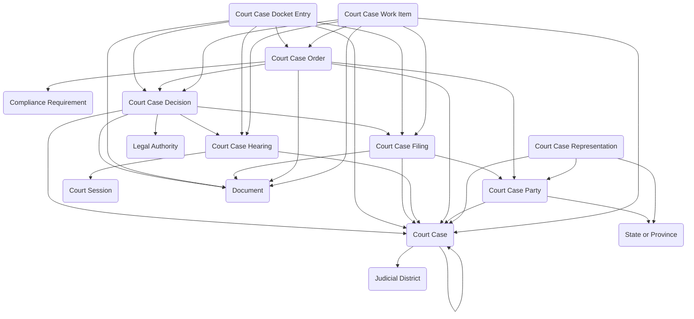

The **Court Case Management** module provides a structured system for tracking legal matters through the complete judicial process, from initial case filing through final disposition and appeals. It provides data entry forms and views for managing case parties and legal representation, recording filings and motions, scheduling hearings and court sessions, documenting judicial decisions and court orders, maintaining chronological docket entries for audit trails, and assigning work items to court staff for case processing. The module supports civil litigation, criminal proceedings, administrative hearings, probate matters, family court cases, and appellate case management with comprehensive visibility into case status, procedural compliance, and judicial workflow.

Typical use cases include trial court docket management, appellate case tracking, clerk of court operations, judicial assignment and workload balancing, court calendar scheduling, case party and attorney management, filing and motion tracking, hearing coordination, order and judgment documentation, and internal case processing task assignment.

## Using the Module

The module provides forms and views to support judicial case management throughout the legal matter lifecycle from filing through final disposition. Foundational scheduling infrastructure is established through **Court Session** records, which define scheduled court sittings with session dates, court locations, presiding officials (assigned judge or magistrate), session status, and calendar block descriptions. Court sessions provide the scheduling foundation that hearings can reference for docket calendar management.

When legal matters are initiated, **Court Case** records document each case with case numbers, case titles, case types (civil, criminal, administrative, probate, family, appellate), case stages (filed, discovery, trial, decided, closed, appealed), assigned judges, judicial district assignments, filing dates, close dates, case status tracking, related case references for consolidated or split matters, and amounts in controversy with currency support. **Court Case Party** records can link persons or organizations to cases in defined roles—plaintiffs, defendants, petitioners, respondents, witnesses, interested parties, or third parties—with party type categorization, lead party indicators, contact information, and state/province references for jurisdiction context. **Court Case Representation** records can document legal representation relationships by connecting parties to their attorneys, guardians ad litem, or agents, including representation type, bar admission references, effective dates for representation periods, and state/province bar jurisdiction.

Throughout case proceedings, **Court Case Docket Entry** records maintain the official chronological audit log of all case activity, providing a complete timeline of filings, hearings, orders, decisions, continuances, and other significant events. Each docket entry captures entry date and time, entry type, entry text or description, sequential docket numbers, references to related filings/hearings/orders/decisions, entered by attribution, and supporting document linkages. This ensures procedural transparency and creates the official record of case progression required for appeals and judicial review.

Case documents and motions are managed through **Court Case Filing** records, which represent formal submissions entered into the case record. Each filing includes filing type (pleading, motion, brief, exhibit, transcript, notice, stipulation), filing date, filing party references, filing status (submitted, accepted, rejected, withdrawn), motion types for motions requiring judicial action, filing numbers, descriptions, and supporting document attachments. Filings can reference related court case decisions when rulings result from filed motions, enabling tracking from motion through disposition.

**Court Case Hearing** records document scheduled appearances and proceedings with hearing types (arraignment, pretrial conference, motion hearing, trial, sentencing, status conference, oral argument), scheduled dates and times, hearing status (scheduled, continued, held, cancelled), court session references for calendar placement, hearing location, presiding official, actual start and end times, hearing outcomes, continuance indicators and reasons, next hearing scheduling, and result descriptions. Hearings can reference related filings when hearings address specific motions or pleadings, and generate docket entries for the procedural record.

Judicial actions are captured through **Court Case Decision** records, which document rulings and determinations made during case proceedings. Decisions include decision types (ruling on motion, verdict, judgment, order, opinion, sentence), decision dates, deciding officials (judges, magistrates, hearing officers), decision text or summaries, decision status (draft, issued, appealed, affirmed, reversed), legal authority citations establishing precedent or statutory basis, and supporting document references for published opinions or detailed orders. Decisions can reference the filings and hearings they address, maintaining clear linkage from motion through ruling.

**Court Case Order** records represent formal directives issued by the court, often derived from decisions but documented separately for enforcement and compliance tracking. Orders capture order types (temporary restraining order, preliminary injunction, protective order, consent decree, final judgment, compliance order), issue dates, effective dates, expiration dates for temporary orders, order status (draft, issued, stayed, vacated, modified), compliance requirement references for regulatory orders, affected party references, enforcement indicators, and supporting document attachments. Orders generate docket entries and can reference the decisions and hearings from which they originate.

Internal case management is supported through **Court Case Work Item** records, which provide task tracking for court staff responsible for advancing cases through judicial processes. Work items include work item types (review filing, schedule hearing, prepare order, process judgment, notice parties, docket entry), assignment to staff persons or organization units, due dates, priority levels, work item status (pending, in progress, completed, cancelled), related case references, and specific linkages to the filings, hearings, orders, or decisions requiring staff action. This enables workflow coordination, workload balancing, and timely case processing.

