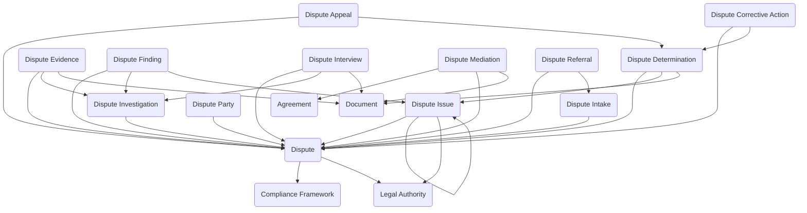

The **Dispute Resolution** module provides a structured data model for managing internal complaints, grievances, and disputes from initial intake through investigation, mediation, determination, and appeals. The data model supports documenting dispute allegations and parties, conducting investigations with evidence and interview tracking, facilitating mediation and alternative dispute resolution, analyzing issues and making formal determinations with findings, tracking corrective actions and remediation, processing appeals of determinations, and managing referrals to internal or external authorities. The module supports employee grievances and workplace disputes, vendor and contractor disputes, customer complaints requiring investigation, internal policy violations, ethics concerns, discrimination or harassment complaints, labor relations matters, and alternative dispute resolution programs with full audit trails and confidentiality controls.

Typical use cases include employee grievance processing, workplace conflict resolution, discrimination and harassment complaint handling, labor relations dispute management, vendor dispute resolution, ethics violation reviews, alternative dispute resolution programs, and internal complaint system administration.

## Using the Module

The module provides a data model to support dispute case management throughout the complete lifecycle from intake through resolution and appeals. Dispute cases can originate through **Dispute Intake** records capturing initial inquiries, concerns, or reports prior to formal case creation with intake source, intake date, reporter information when available, concern summary, anonymous reporting indicators, triage assessment, and early resolution efforts. Once accepted, **Dispute** records serve as the primary case entity with case numbers, case titles, dispute types (grievance, discrimination, harassment, ethics violation, policy dispute, vendor dispute, labor relations, retaliation), decision status, filed dates, assigned staff, organization unit ownership, **Legal Authority** and **Compliance Framework** citations establishing policy or regulatory basis, confidentiality indicators, and case priority. **Dispute Party** records link persons or organizations to cases in defined roles—complainants, respondents, witnesses, representatives, investigators, mediators, or decision makers.

When disputes require structured analysis, **Dispute Issue** records define specific allegations, claims, or concerns within the case, as a single dispute may address multiple issues (discrimination, retaliation, harassment, policy violations). Issues can reference **Legal Authority** for policy or regulation citations and support hierarchical relationships for complex, multi-faceted disputes. **Dispute Investigation** records document formal investigative processes with investigator assignments, investigation scope and objectives, timelines, methodology, investigation status, and completion details. **Dispute Interview** records track interviews conducted during investigation with interviewee information, interview dates, interview roles, interview locations, summaries, and supporting document references. **Dispute Evidence** records store or reference collected materials—documents, communications, records, media files, reports—with evidence descriptions, collection dates, evidence types, and document attachments.

Investigation analysis produces **Dispute Finding** records capturing conclusions for specific dispute issues with finding types (substantiated, unsubstantiated, inconclusive, policy violation confirmed, not a violation), finding dates, finding text and rationale, and evidence linkages. Findings inform **Dispute Determination** records representing formal outcomes or decisions with determination types (sustained, not sustained, dismissed, settled, resolved informally, no action required), determination dates, deciding officials, determination text and rationale, remedies or actions ordered, and supporting document references for formal decision documentation.

Alternative dispute resolution is supported through **Dispute Mediation** records documenting structured mediation or facilitation efforts with mediator assignments, mediation session dates, mediation type and approach, mediation status, mediation outcomes, **Agreement** references for resulting settlements or resolutions, and supporting documentation. Mediation provides parties opportunity for facilitated resolution before or in lieu of formal determination processes.

Determinations can generate **Dispute Corrective Action** records tracking required actions such as training requirements, disciplinary measures, policy updates, workplace modifications, monitoring plans, or operational changes with action owners, due dates, action status, completion verification, and effectiveness indicators. **Dispute Appeal** records document formal challenges to determinations with appeal filing dates, appeal basis and grounds, appeal authority assignments, appellate review status, appeal outcomes (affirmed, reversed, modified, remanded), and appellate decision rationale.

**Dispute Referral** records track referrals of intakes or cases to other offices, authorities, or support functions—HR departments, legal counsel, security offices, compliance teams, employee assistance programs, ombudsman offices, or external agencies—with referral dates, referral reasons, referral types, referral status, and referred party information for coordination and case routing.

