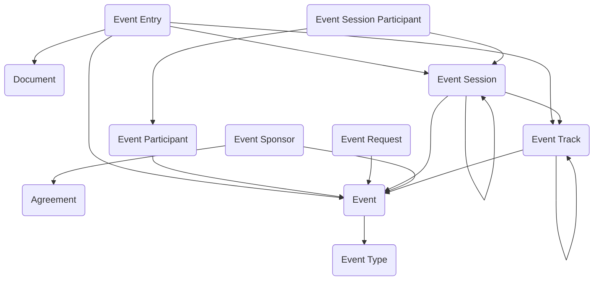

The **Event Management** module enables organizations to plan, organize, and execute events of all types and scales. The module supports defining events with classification and scheduling, managing participant registration and tracking across multiple roles, organizing sessions into thematic tracks with time blocks and locations, capturing presentation and exhibition submissions with review workflows, coordinating event sponsors and partnership arrangements, processing event requests and approvals, and tracking participant check-ins and attendance with certificate issuance. The module accommodates conferences and symposiums, training events and workshops, public hearings and town halls, festivals and community events, board meetings and governance sessions, webinars and virtual events, and hybrid event formats combining in-person and virtual participation.

Typical use cases include conference and symposium management, training program coordination, public engagement and community outreach events, stakeholder meetings and town halls, professional development workshops, virtual and hybrid event execution, sponsor and exhibitor coordination, and continuing education credit tracking.

## Using the Module

The module supports event lifecycle management from planning through execution and follow-up. Users can create **Event Request** records to capture proposed or requested events prior to formal approval with request details, requestor information, proposed dates and locations, event purpose, expected attendance, budget estimates, and approval workflow for intake and evaluation before official event creation.

**Event** records serve as the primary entity defining planned occurrences with event titles, **Event Type** classifications (conference, training, public hearing, webinar, festival, meeting, workshop), event codes, event formats (in-person, virtual, hybrid), descriptions, start and end dates/times, primary locations, decision status, expected and actual attendee counts, event status throughout the lifecycle (draft, planning, open for registration, registration closed, in progress, completed, cancelled, postponed), and ownership assignments. Events can be organized into **Event Track** records representing thematic or organizational groupings—technology, policy, community outreach, breakout topics—with hierarchical track relationships enabling nested track structures for complex events.

**Event Participant** records represent individuals or organizations involved with participant types (attendee, speaker, presenter, panelist, moderator, staff, volunteer, exhibitor, sponsor representative, VIP, media), participation status (invited, tentative, registered, confirmed, waitlisted, checked-in, attended, no-show, cancelled, declined), registration dates, check-in tracking, payment status, certificate issuance indicators, dietary restrictions or accessibility needs, and contact information. Participants can be linked to specific sessions through **Event Session Participant** records when attendance, roles, or responsibilities differ by session.

**Event Session** records represent scheduled time blocks within events—breakout sessions, hearing segments, workshops, keynote slots, panel discussions—with session titles, session descriptions, start and end times, session locations or virtual meeting details, session capacity and current registration counts, session status, **Event Track** assignments, parent session references for multi-part sessions, and session moderator or facilitator assignments. Sessions provide granular scheduling and capacity management for complex multi-track events.

**Event Entry** records represent exhibitions, presentations, booths, posters, demonstrations, or other showcased submissions with entry titles, entry descriptions, entry types and formats, submission dates, review and approval status, assigned **Event Session** or **Event Track** references, presenter assignments, supporting document attachments, and approval workflow for managing call-for-papers, call-for-posters, or exhibitor application processes.

**Event Sponsor** records document organizations or entities providing financial or in-kind support with sponsor names, sponsorship levels (platinum, gold, silver, bronze, in-kind), sponsorship types, contribution amounts with currency support, commitment dates, **Agreement** references for formal sponsorship contracts, sponsorship benefits and deliverables, logo and branding materials, and sponsor contact information for partnership coordination and benefit fulfillment.

