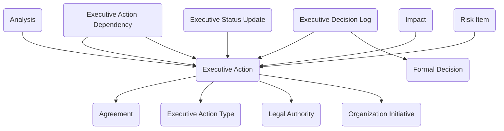

The **Executive Coordination** module provides a structured way to issue, assign, track, and evaluate executive actions, directives, and high-level taskers that require coordinated response across organizational units. It provides data entry forms and views for documenting action requirements, assigning accountability, managing dependencies, capturing decisions, and reporting progress through completion. Links to legal authorities, agreements, strategic initiatives, risk assessments, and impact analyses provide supporting context, while executive status updates maintain visibility into action health and completion.

Typical use cases include managing executive office directives, policy implementation taskers, compliance-driven actions, strategic initiative coordination, crisis response actions, and cross-organizational accountability tracking.

## Using the Module

The module provides forms and views to document and coordinate executive actions throughout their lifecycle from issuance through closure. Foundational reference data is established using **Executive Action Types** to categorize actions (e.g., Executive Order, Policy Directive, Compliance Tasker, Strategic Initiative, Crisis Response) and define default handling requirements such as priority, required assessments, and legal authority expectations.

When a directive or tasker is issued, **Executive Action** records can capture the action number, description, issuing details (issued by, issue date, issuing authority), strategic alignment, success criteria, and classification. Actions can be linked to supporting context including **Organization Initiatives** for strategic alignment, **Legal Authorities** to document statutory or regulatory basis, and **Agreements** when actions implement partnership commitments. Accountability is established through executive sponsor, accountable lead, and lead organization unit assignments, with target and actual completion dates tracked for timeline management. Budget estimates, effort hours, priority, lifecycle stage, and overall health indicators provide operational visibility.

The module supports coordination across dependent actions through **Executive Action Dependency** records, which document predecessor-successor relationships, dependency types (finish-to-start, start-to-start, etc.), critical path indicators, and impact assessments if dependencies are not met. This maintains visibility into sequencing requirements and coordination constraints across complex action portfolios.

Throughout execution, **Executive Status Updates** provide periodic progress reporting with status date, reporting period, percent complete, action status, overall health assessment, and structured narratives for key accomplishments, next steps, challenges and risks, decisions needed, and resource concerns. Timeline impact, budget impact, scope change requests, and escalation flags alert leadership to emerging issues requiring attention.

The module maintains a decision record through **Executive Decision Log** entries, which document significant decisions made during action execution including decision date, decided by, decision authority, decision category, rationale, and impact assessments on timeline, budget, scope, and accountability. Decisions can be linked to **Formal Decision** records when governance processes require structured decision documentation, with communicated date and implementation date tracked for transparency.

Supporting context can be maintained through lookups to **Analysis**, **Impact**, and **Risk Item** records, ensuring that actions are grounded in analytical findings, impact assessments, and risk management considerations. Action status, percent complete, completed and total action items, and actual completion dates provide a comprehensive record of execution outcomes for accountability, audit, and organizational learning.

