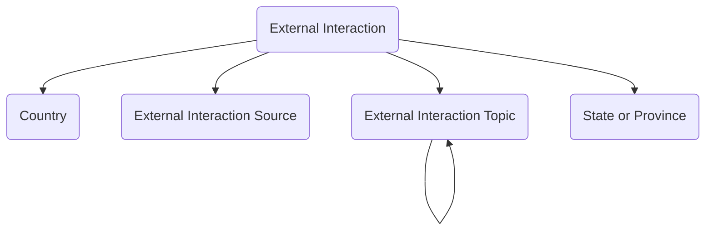

The **External Interaction** module provides a structured approach to capturing, routing, and managing incoming communications from external parties across multiple contact channels. The module enables organizations to track correspondence with partners and stakeholders, manage public inquiries, document constituent engagement, and maintain comprehensive interaction histories with consistent follow-up and resolution tracking.

Typical use cases include tracking correspondence with partners and vendors, managing public inquiries and citizen requests, documenting stakeholder meetings and engagements, constituent management and casework, and coordinating responses to external communications across organizational teams.

## Using the Module

The module provides forms and views to capture external interaction information from initial receipt through assignment, progress tracking, and final resolution. Foundational reference data is established using **External Interaction Topics** to categorize inquiry subjects with hierarchical parent-child topic relationships enabling detailed subject taxonomies, and **External Interaction Sources** to document originating channels, programs, or referral organizations that generate incoming interactions.

When external communications are received, **External Interaction** records can capture identifying details including reference numbers, received date and time, and method of contact (in-person, phone, email, social media, web form, mail). Contact information can be structured with fields for first and last name, phone numbers (home, mobile, work), email addresses (personal, work), mailing address with country and state/province lookups, and social media URLs. When the submitter is an existing contact, **Person** (Contact) lookups can establish persistent relationships. Each interaction can document topic classification, source attribution, interaction type, priority level, and detailed descriptions of the inquiry or communication content.

The module supports internal routing and assignment workflows through integration with standard Dataverse **Queues**. Interactions can be placed into **Queue Items** for team-based workload distribution, enabling organizations to route inquiries to specialized departments, subject matter experts, or geographic service teams. Action status tracking provides visibility into interaction lifecycle stages from new receipt through in-progress work to final resolution. Follow-up dates and due dates can be established with separate first response due dates and resolution due dates supporting service level commitments.

Throughout the interaction lifecycle, **Progress Notes** fields can maintain running commentary on actions taken, questions asked, information gathered, and coordination efforts. Supporting activities can be tracked through standard Dataverse activity entities including **Appointments** for scheduled meetings, **Phone Calls** for documented conversations, **Emails** for electronic correspondence, **Letters** for formal written responses, and **Tasks** for action item tracking. These activities provide an auditable timeline of all engagement touchpoints related to each external interaction.

The module includes an **Interaction Assistant** custom page that streamlines common interaction management tasks. The assistant provides a unified interface for updating progress notes, drafting acknowledgement messages using AI (optional feature), resolving interactions to existing or new contacts, routing to queues, and marking interactions as resolved.

When interactions reach resolution, **Resolution Notes** fields can document final outcomes, answers provided, actions completed, or reasons for closure, building an organizational knowledge base of common inquiries and standard responses. Custom page state fields can preserve user interface context for complex multi-step interaction management scenarios.

