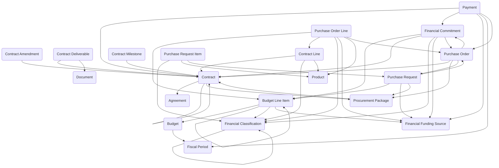

The **Financial Management** module provides a structured data model for end-to-end financial planning, procurement, contractual oversight, and financial execution. The data model supports defining budgets and funding sources, validating availability of funds, managing procurement processes from requisition through competitive sourcing, formalizing agreements through contracts and amendments, issuing purchase orders against contracts, recording financial commitments to reserve funds, and processing payments to suppliers with invoice tracking. The module enables departmental budget control, competitive sourcing and vendor selection, contract lifecycle management, project or grant-funded spending, compliance-driven funds certification, structured payment tracking, and complete financial traceability from initial request through contract award to final payment for financial accountability, operational transparency, and audit readiness.

Typical use cases include departmental budget planning and monitoring, purchase requisition and approval workflows, competitive procurement and vendor selection, contract negotiation and award, purchase order management, funds commitment and obligation tracking, invoice processing and payment disbursement, and grant or project financial oversight.

## Using the Module

The module provides a data model to support the complete financial lifecycle from budget planning through payment execution. **Budget** records define approved financial plans for fiscal periods and organizational scope with budget numbers, budget period start and end dates, total budgeted amounts with currency support, approval workflow, budget status (draft, pending approval, approved, active, amended, closed, cancelled), and **Fiscal Period** references. **Budget Line Item** records provide detailed allocations within budgets tied to **Financial Funding Source** identifications (appropriation, grant, contract revenue, fee revenue, cost center, project funding), **Financial Classification** categorizations (expense category, object class, cost element, account code, program code), allocated amounts, committed amounts, expended amounts, and available balance calculations for funds control and commitment validation.

**Financial Funding Source** records identify origins of funds with funding source names, funding source types, parent funding source relationships for hierarchical fund structures, effective dates, total funding amounts, and funding status. **Financial Classification** records provide categorization structures with classification names, classification types, codes, and parent classification hierarchies for flexible financial taxonomy supporting reporting, budget allocation, compliance, and accounting integration.

Procurement begins with **Purchase Request** records capturing internal requests for goods or services with request numbers, requestor assignments, request dates, business justification, estimated costs, approval workflow, request status, **Financial Funding Source** and **Budget Line Item** references for funds availability validation, and **Procurement Package** linkages when competitive sourcing is required. **Purchase Request Item** records specify line-level detail with requested quantities, **Product** references, estimated unit prices, **Financial Classification** assignments, and delivery requirements.

**Procurement Package** records manage sourcing processes—competitive bids, requests for proposals, requests for quotes, sole-source procurements—with package numbers, procurement methods, solicitation dates, proposal due dates, evaluation criteria, vendor response tracking, award decisions, and approval workflow prior to contract execution. Procurement packages can generate **Contract** records upon award.

**Contract** records formalize agreements with external organizations defining contract numbers, contract titles, **Agreement** references for master agreements, contract types, vendors, contract status, period of performance with start and end dates, total contract values with currency support, parent contract references for amendments or task orders, and primary contact assignments. **Contract Amendment** records document modifications with amendment numbers, effective dates, amendment types, change descriptions, amended contract values, and approval tracking for structured change history. **Contract Line** records provide pricing or scope elements—labor categories, fixed-price items, cost-reimbursable components—with line descriptions, unit prices, quantities, **Product** references, and **Financial Classification** assignments enabling financial tracking aligned with contract structures. **Contract Deliverable** records specify required outputs with deliverable descriptions, due dates, acceptance criteria, deliverable status, and supporting document references. **Contract Milestone** records track significant events—kickoff, phase completion, renewal decisions, option exercises—with milestone dates, milestone types, milestone status, and completion tracking.

Financial execution proceeds through **Financial Commitment** records representing funds formally reserved or obligated for approved actions with commitment numbers, commitment dates, commitment amounts, **Financial Funding Source** and **Budget Line Item** references for funds reservation, **Contract** and **Purchase Order** linkages, commitment status, and expiration dates. Commitments reduce available budget providing forward visibility into planned spending prior to invoice receipt.

**Purchase Order** records authorize orders to suppliers with purchase order numbers, order dates, suppliers, **Contract** references establishing contractual authority, **Procurement Package** linkages, purchase order status, total order amounts, delivery addresses, requested delivery dates, and approval workflow. **Purchase Order Line** records specify item or service details with quantities, unit prices, **Product** references, **Contract Line** alignments for contract compliance, **Financial Classification** and **Financial Funding Source** assignments, and **Budget Line Item** references for funds control.

**Payment** records represent fund disbursements with payment numbers, payment dates, payment amounts with currency support, payees, payment methods, payment status, **Contract**, **Purchase Order**, and **Financial Commitment** references establishing payment authorization, invoice numbers, invoice dates, **Financial Funding Source** allocations, **Fiscal Period** assignments for accounting close, and payment descriptions for reconciliation and audit support.

