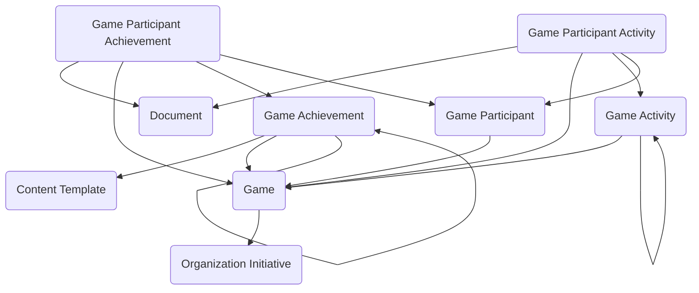

The **Gamification** module provides a structured data model for encouraging, tracking, and recognizing desired behaviors across programs, teams, and initiatives. The data model supports defining games as time-bound or ongoing engagement initiatives, configuring activities that represent measurable actions, establishing achievements that participants can earn based on participation or performance, enrolling participants with individual or team participation models, logging activity instances as participants perform actions, and granting achievement recognition when criteria are met. The module can reinforce training completion, safety compliance, case resolution timeliness, volunteer engagement, productivity milestones, wellness initiatives, community participation, or internal innovation efforts, providing a flexible behavioral reinforcement layer that can operate alongside workforce, compliance, training, service delivery, or operational modules.

Typical use cases include training challenge campaigns, performance improvement drives, compliance tracking initiatives, employee wellness programs, safety recognition systems, volunteer engagement tracking, innovation and idea submission campaigns, service excellence recognition, onboarding milestone tracking, and community engagement programs.

## Using the Module

The module provides a data model to support gamification initiatives from design through participant recognition. **Game** records define structured gamification initiatives or campaigns with game names, game codes, **Game Type** classifications (training challenge, performance drive, compliance campaign, wellness initiative, safety program, volunteer campaign, innovation challenge, service excellence, onboarding program, community engagement), game descriptions and objectives, start and end dates, ongoing indicator for continuous programs, game status (planning, open for enrollment, active, paused, completed, archived, cancelled), participation models (individual, team, department, organization-wide, invitation-only, tiered), open enrollment indicators, leaderboard enabling for competitive visibility, active participant counts, **Organization Initiative** linkages for strategic alignment, and banner or logo URL references for branding.

**Game Activity** records define types of actions tracked within games representing measurable behaviors—training completion, task completion, event attendance, case resolution, time logged, certification earned, feedback submitted, survey completion, mentor session, safety report, innovation submission, volunteer hours—with activity names, activity descriptions, activity types, point values or weights, parent activity relationships for hierarchical activity structures, and activity status for enabling or disabling specific actions.

**Game Achievement** records establish achievements that can be earned with achievement names, achievement descriptions, achievement types (badge, level, tier, milestone, certificate, title, rank, recognition), achievement criteria and requirements, point thresholds or completion counts, achievement tier or level indicators, **Content Template** references for certificate generation, parent achievement relationships for progressive achievement paths, and achievement status for availability management.

**Game Participant** records represent individuals or teams enrolled in specific games with participation status (invited, enrolled, active, inactive, completed, withdrawn), enrollment dates, participation roles (participant, team lead, administrator), team assignments for team-based games, total activity counts, total achievements earned counts, current point or score totals, current rank or tier indicators, and participation context maintaining individual progress and standing within games.

As participants perform actions, **Game Participant Activity** records log instances of defined activities with activity dates and times, **Game Activity** references, **Game Participant** linkages, point values earned, activity completion indicators, verification or approval status, notes or descriptions, and supporting document attachments creating behavioral history used to evaluate achievement criteria and calculate performance metrics.

When achievement criteria are met, **Game Participant Achievement** records grant recognition with achievement dates, **Game Achievement** references, **Game Participant** linkages, achievement status (pending, awarded, verified, revoked), verification workflow, notes, and supporting document references for certificates or recognition materials providing transactional recognition tracking and participant accomplishment history.

