The **HR Administration** module provides a comprehensive system for managing workforce positions, employment actions, time and attendance, employee requests, and compliance documentation. It provides data entry forms and views for establishing position structures, processing personnel actions, managing time off and telework requests, documenting workplace accommodations, tracking disciplinary matters, and maintaining employee declarations. Integration with job classifications, pay grades, clearance requirements, and organizational structure ensures consistent workforce management aligned with classification standards and governance requirements.

Typical use cases include managing position authorizations and assignments, processing promotions and transfers, handling leave requests and donations, coordinating telework arrangements, documenting workplace accommodations, maintaining employment milestones, tracking disciplinary actions, capturing compliance declarations, and managing overtime authorization.

## Using the Module

The module provides forms and views to support workforce administration throughout the employee lifecycle from position planning through separations. Foundational reference data is established using **HR Job Classifications** to define standard position categories with classification codes, FLSA status, supervisory indicators, default pay grades, and **Job Series** linkages for occupational grouping. **Personnel Types** categorize workforce segments (e.g., civilian, contractor, military), while **HR Action Types** standardize employment action categories (hire, promotion, transfer, separation) with approval requirements. **HR Pay Grades**, **Grade Ranks**, and **HR Ranks** provide pay scale structures, and **Clearance Levels** define security clearance requirements for sensitive positions.

Position management begins with **HR Position** records documenting authorized positions with position numbers, job classification assignments, organizational placement, location, employment type, full-time equivalent (FTE), pay grade, clearance requirements, supervisory relationships, and budget codes. Positions can reference personnel type, bargaining unit, and effective date ranges to manage position lifecycles. **HR Position Descriptions** capture detailed position documentation including purpose, primary duties, key responsibilities, required and preferred qualifications, supervisory responsibilities, physical requirements, and working conditions, with version control, approval workflow, and supporting document attachments.

When employees are assigned to positions, **HR Position Assignment** records link persons to positions with assignment type (permanent, temporary, acting, detailed), start and end dates, FTE allocation for partial assignments, primary assignment indicators, reporting relationships (reports to person and position), and assignment status tracking. This supports multiple concurrent assignments, acting appointments, and detailed assignments while maintaining historical assignment records.

Personnel changes are processed through **HR Employment Action** records, which document employment transactions referenced by action type (hire, promotion, transfer, reassignment, salary adjustment, separation, retirement). Each action captures action number, effective date, approval workflow (requested by, approved by, approval status, approval date), and before/after context for position, location, organization unit, employment type, FTE, pay grade, grade/rank, and salary fields. Justification, description, impact narratives, and legal authority references provide supporting documentation, while action status and processing details maintain transaction audit trails.

Throughout employment, **HR Employment Milestones** document significant events such as probationary completion, awards, service anniversaries, eligibility dates, and certification achievements. Milestone records include milestone type and date, years of service calculations, notification tracking, recognition indicators, and recorded by attribution for lifecycle visibility and employee recognition programs.

Time and attendance management is supported through **HR Request** records providing a common request structure for various HR actions, with request number, type, status, priority, requested dates, approval workflow, and denial reason capturing. **HR Time Off Requests** extend this base with leave type specification, total hours requested/approved/taken, start/end/return dates, reason narratives, emergency contact information, and supporting documentation for leave management. Individual **HR Time Off Entries** break down approved leave into daily or partial-day increments for payroll integration and balance tracking.

For employees requiring leave support, **HR Leave Donation** records facilitate leave sharing programs by documenting donor and recipient persons, leave types donated and received, hours donated and received with conversion rates, approval workflow, balance before/after snapshots, and processing status for accountability and payroll adjustments.

**HR Overtime Entry** records capture overtime work with work date, hours worked, overtime type and rate, pay calculations, approval workflow, pay period reference, project codes for cost allocation, and justification narratives for overtime authorization and compensation tracking.

Modern workplace flexibility is managed through **HR Telework Request** records documenting telework arrangements with telework type and frequency, start/end dates, business justification, primary telework location and address, equipment needs, internet availability, schedule descriptions, agreement signature status, safety checklist completion, and supervisor approval for remote work coordination. **HR Workplace Accommodation** requests manage reasonable accommodation processes with accommodation type, need description, requested and approved accommodation details, medical documentation indicators, privacy consent references, implementation details (date, cost), effectiveness evaluation, temporary or permanent status, and approval workflow supporting ADA compliance.

Workforce compliance and conduct are maintained through **HR Employee Declaration** records capturing required employee attestations such as financial disclosures, conflict of interest statements, ethics acknowledgments, or policy certifications. Each declaration includes declaration type and content, compliance framework and legal authority references, attestation status and date, submission/review dates, reviewer, review comments, effective and expiration dates, and supporting documents for regulatory compliance and audit readiness.

**HR Disciplinary Action** records document conduct and performance matters with disciplinary action type, incident date and description, violation type, action taken, effective and expiration dates, issue date, issuing authority, appeal filed status, appeal date and outcome, employee response, legal authority references, supporting documents, and security classification for sensitive personnel matters. Action status tracking maintains case progression through investigation, action, and appeal phases.

```mermaid
graph TD
  appbase_ClearanceLevel(Clearance Level)
  appbase_ComplianceFramework(Compliance Framework)
  appbase_Document(Document)
  appbase_GradeRank(Grade Rank)
  appbase_HRActionType(HR Action Type)
  appbase_HRDisciplinaryAction(HR Disciplinary Action)
  appbase_HREmployeeDeclaration(HR Employee Declaration)
  appbase_HREmploymentAction(HR Employment Action)
  appbase_HRJobClassification(HR Job Classification)
  appbase_HRPayGrade(HR Pay Grade)
  appbase_HRPosition(HR Position)
  appbase_HRPositionAssignment(HR Position Assignment)
  appbase_HRPositionDescription(HR Position Description)
  appbase_HRRank(HR Rank)
  appbase_HRRequest(HR Request)
  appbase_HRTeleworkRequest(HR Telework Request)
  appbase_HRTimeOffEntry(HR Time Off Entry)
  appbase_HRTimeOffRequest(HR Time Off Request)
  appbase_HRWorkplaceAccommodation(HR Workplace Accommodation)
  appbase_JobSeries(Job Series)
  appbase_LegalAuthority(Legal Authority)
  appbase_PayGrade(Pay Grade)
  appbase_PersonnelType(Personnel Type)
  appbase_PrivacyConsent(Privacy Consent)
  appbase_HRPosition --> appbase_ClearanceLevel
  appbase_HREmployeeDeclaration --> appbase_ComplianceFramework
  appbase_HRDisciplinaryAction --> appbase_Document
  appbase_HREmployeeDeclaration --> appbase_Document
  appbase_HRPositionDescription --> appbase_Document
  appbase_HRTimeOffRequest --> appbase_Document
  appbase_HRWorkplaceAccommodation --> appbase_Document
  appbase_HRPosition --> appbase_GradeRank
  appbase_HREmploymentAction --> appbase_HRActionType
  appbase_HRPosition --> appbase_HRJobClassification
  appbase_HREmploymentAction --> appbase_HRPayGrade
  appbase_HREmploymentAction --> appbase_HRPayGrade
  appbase_HREmploymentAction --> appbase_HRPosition
  appbase_HREmploymentAction --> appbase_HRPosition
  appbase_HRPosition --> appbase_HRPosition
  appbase_HRPositionAssignment --> appbase_HRPosition
  appbase_HRPositionAssignment --> appbase_HRPosition
  appbase_HRPositionDescription --> appbase_HRPosition
  appbase_HREmploymentAction --> appbase_HRRank
  appbase_HREmploymentAction --> appbase_HRRank
  appbase_HRTeleworkRequest --> appbase_HRRequest
  appbase_HRTimeOffRequest --> appbase_HRRequest
  appbase_HRWorkplaceAccommodation --> appbase_HRRequest
  appbase_HRTimeOffEntry --> appbase_HRTimeOffRequest
  appbase_HRJobClassification --> appbase_JobSeries
  appbase_HRPosition --> appbase_JobSeries
  appbase_HRDisciplinaryAction --> appbase_LegalAuthority
  appbase_HREmployeeDeclaration --> appbase_LegalAuthority
  appbase_HREmploymentAction --> appbase_LegalAuthority
  appbase_HRJobClassification --> appbase_PayGrade
  appbase_HRPosition --> appbase_PayGrade
  appbase_HRPosition --> appbase_PersonnelType
  appbase_HRWorkplaceAccommodation --> appbase_PrivacyConsent
```

