The **HR Benefits** module provides a structured data model for managing the full lifecycle of employee benefit offerings from plan design and eligibility configuration to enrollment, life event changes, and cost administration. The data model supports defining benefit plans with options and coverage levels, managing benefit providers and service agreements, configuring eligibility rules and waiting periods, establishing enrollment periods for open enrollment and new hires, processing benefit enrollments with elections and beneficiary designations, handling qualifying life event changes, administering contribution rates for employer and employee costs, tracking cost allocations across funds and departments, maintaining deduction codes for payroll integration, and processing benefit-related claims or reimbursements with effective dating, auditability, and structured benefit governance.

Typical use cases include open enrollment administration, new hire benefit setup, qualifying life event processing, beneficiary management for life insurance and retirement plans, benefit cost analysis and allocation, payroll deduction coordination, benefit claim processing, benefits compliance reporting, and benefits provider relationship management.

## Using the Module

The module provides a data model to support benefits administration from plan design through enrollment and cost management. **HR Benefit Plan** records define specific benefit offerings with plan names, plan years, **HR Benefit Provider** assignments, plan types and categories (medical, dental, vision, life insurance, disability, retirement, health savings account, flexible spending account, wellness, tuition assistance, employee assistance program), plan status, effective dates, **Legal Authority** and **Compliance Framework** references for regulatory compliance, parent plan relationships for dependent plans, and plan descriptions. **HR Benefit Provider** records store benefit carriers or administrators with provider names, provider types (insurance carrier, third-party administrator, retirement board, HMO, PPO, self-insured), **Agreement** references for service contracts, and provider contact information.

Benefit plan structure is defined through **HR Benefit Option** records representing selectable options within plans—PPO versus HDHP, basic versus premium coverage, investment fund choices—with option names, option descriptions, option codes, default selection indicators, and option status. **HR Benefit Coverage Level** records define coverage tiers (employee only, employee plus spouse, employee plus dependents, employee plus family, retiree, continuation coverage) with coverage level names, ordering sequences, coverage descriptions, and effective dates for pricing and eligibility determination. **HR Benefit Plan Document** records maintain plan-related documentation—summary plan descriptions, policy documents, regulatory filings, internal guidelines—with document types, document dates, document versions, and supporting document attachments.

Eligibility is managed through **HR Benefit Eligibility Rule** records defining participation conditions with rule names, eligibility criteria descriptions, employment type restrictions, **Pay Grade** or **Personnel Type** requirements, service duration thresholds, location requirements, bargaining unit specifications, and effective dates for reusable eligibility enforcement. **HR Benefit Waiting Period** records establish waiting period rules with period types, waiting period durations (days), effective dates for eligibility start calculations, and alignment options (first of month following eligibility).

Enrollment cycles are defined through **HR Benefit Enrollment Period** records representing enrollment windows with period names, period types (open enrollment, new hire enrollment, special enrollment, annual enrollment), start and end dates, enrollment deadlines, period status, and eligible employee populations. **HR Benefit Enrollment** records represent individual enrollments with persons, **HR Benefit Plan** references, **HR Benefit Option** selections, **HR Benefit Coverage Level** assignments, enrollment effective and termination dates, enrollment status (pending, active, terminated, cancelled), enrollment sources, waiver indicators for declined benefits, **HR Benefit Enrollment Period** linkages, **HR Benefit Life Event** references for mid-year changes, and **HR Benefit Deduction Code** assignments for payroll integration.

**HR Benefit Election** records capture detailed selections within enrollments—optional riders, add-ons, sub-options—with election descriptions, election amounts or values, election effective dates, and election status. **HR Benefit Beneficiary** records store beneficiary designations for plans requiring them with beneficiary persons or names, beneficiary types (primary, secondary, contingent), relationship descriptions, allocation percentages, designation priorities for sequencing, effective dates, addresses, dates of birth, and beneficiary status for life insurance and retirement plan administration.

Life event processing is supported through **HR Benefit Life Event** records documenting qualifying events—marriage, birth, adoption, divorce, death, loss of coverage—with life event types, event dates, reported dates, persons affected, event descriptions, supporting documentation, approval status, and qualifying event verification. **HR Benefit Life Event Change** records track specific enrollment modifications resulting from life events with original and new **HR Benefit Option** references, original and new **HR Benefit Coverage Level** references, change types, change effective dates, change request descriptions, approval workflow, and change status for mid-year enrollment adjustments.

Financial management is handled through **HR Benefit Contribution Rate** records defining employer and employee cost structures with **HR Benefit Plan**, **HR Benefit Option**, and **HR Benefit Coverage Level** references, effective dates, employer contribution amounts or percentages, employee contribution amounts or percentages, total premium amounts with currency support, contribution frequency (monthly, per pay period, annual), and rate structures supporting percentage-based or fixed-amount contributions with effective dating. **HR Benefit Cost Allocation** records define how employer costs are distributed across financial dimensions with **HR Benefit Plan** references, cost center or fund identifications, allocation percentages, effective dates, and allocation descriptions enabling split allocations for grant-funded or multi-entity cost management.

**HR Benefit Deduction Code** records map enrollments to payroll systems with deduction code identifications, deduction descriptions, **HR Benefit Plan** references, effective dates, deduction sequences, and payroll system integration identifiers. **HR Benefit Claim** records track internal benefit-related claims or reimbursements—tuition reimbursement, wellness reimbursement, dependent care—with claim numbers, claim types, claim dates, claimant persons, **HR Benefit Enrollment** references, claim amounts with currency support, claim status (submitted, under review, approved, denied, paid), approval workflow, payment dates, payment methods, and supporting documentation.

```mermaid
graph TD
  appbase_Agreement(Agreement)
  appbase_ComplianceFramework(Compliance Framework)
  appbase_Document(Document)
  appbase_HRBenefitBeneficiary(HR Benefit Beneficiary)
  appbase_HRBenefitClaim(HR Benefit Claim)
  appbase_HRBenefitContributionRate(HR Benefit Contribution Rate)
  appbase_HRBenefitCostAllocation(HR Benefit Cost Allocation)
  appbase_HRBenefitCoverageLevel(HR Benefit Coverage Level)
  appbase_HRBenefitDeductionCode(HR Benefit Deduction Code)
  appbase_HRBenefitElection(HR Benefit Election)
  appbase_HRBenefitEligibilityRule(HR Benefit Eligibility Rule)
  appbase_HRBenefitEnrollment(HR Benefit Enrollment)
  appbase_HRBenefitEnrollmentPeriod(HR Benefit Enrollment Period)
  appbase_HRBenefitLifeEvent(HR Benefit Life Event)
  appbase_HRBenefitLifeEventChange(HR Benefit Life Event Change)
  appbase_HRBenefitOption(HR Benefit Option)
  appbase_HRBenefitPlan(HR Benefit Plan)
  appbase_HRBenefitPlanDocument(HR Benefit Plan Document)
  appbase_HRBenefitProvider(HR Benefit Provider)
  appbase_HRBenefitWaitingPeriod(HR Benefit Waiting Period)
  appbase_LegalAuthority(Legal Authority)
  appbase_HRBenefitProvider --> appbase_Agreement
  appbase_HRBenefitPlan --> appbase_ComplianceFramework
  appbase_HRBenefitClaim --> appbase_Document
  appbase_HRBenefitEnrollment --> appbase_Document
  appbase_HRBenefitLifeEvent --> appbase_Document
  appbase_HRBenefitPlanDocument --> appbase_Document
  appbase_HRBenefitContributionRate --> appbase_HRBenefitCoverageLevel
  appbase_HRBenefitEnrollment --> appbase_HRBenefitCoverageLevel
  appbase_HRBenefitLifeEventChange --> appbase_HRBenefitCoverageLevel
  appbase_HRBenefitLifeEventChange --> appbase_HRBenefitCoverageLevel
  appbase_HRBenefitEnrollment --> appbase_HRBenefitDeductionCode
  appbase_HRBenefitBeneficiary --> appbase_HRBenefitEnrollment
  appbase_HRBenefitClaim --> appbase_HRBenefitEnrollment
  appbase_HRBenefitElection --> appbase_HRBenefitEnrollment
  appbase_HRBenefitLifeEventChange --> appbase_HRBenefitEnrollment
  appbase_HRBenefitEnrollment --> appbase_HRBenefitEnrollmentPeriod
  appbase_HRBenefitEnrollment --> appbase_HRBenefitLifeEvent
  appbase_HRBenefitLifeEventChange --> appbase_HRBenefitLifeEvent
  appbase_HRBenefitContributionRate --> appbase_HRBenefitOption
  appbase_HRBenefitEnrollment --> appbase_HRBenefitOption
  appbase_HRBenefitLifeEventChange --> appbase_HRBenefitOption
  appbase_HRBenefitLifeEventChange --> appbase_HRBenefitOption
  appbase_HRBenefitClaim --> appbase_HRBenefitPlan
  appbase_HRBenefitContributionRate --> appbase_HRBenefitPlan
  appbase_HRBenefitCostAllocation --> appbase_HRBenefitPlan
  appbase_HRBenefitCoverageLevel --> appbase_HRBenefitPlan
  appbase_HRBenefitDeductionCode --> appbase_HRBenefitPlan
  appbase_HRBenefitEligibilityRule --> appbase_HRBenefitPlan
  appbase_HRBenefitEnrollment --> appbase_HRBenefitPlan
  appbase_HRBenefitOption --> appbase_HRBenefitPlan
  appbase_HRBenefitPlan --> appbase_HRBenefitPlan
  appbase_HRBenefitPlanDocument --> appbase_HRBenefitPlan
  appbase_HRBenefitWaitingPeriod --> appbase_HRBenefitPlan
  appbase_HRBenefitPlan --> appbase_HRBenefitProvider
  appbase_HRBenefitPlan --> appbase_LegalAuthority
```

