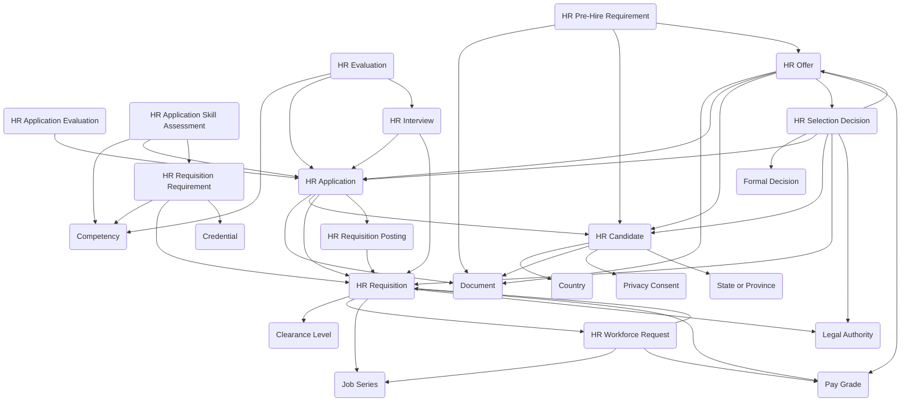

The **HR Recruiting module** enables organizations to manage the complete hiring process from initial workforce requests through final candidate selection and offer management. It provides structured workflows for requisition management, candidate tracking, evaluation, and selection across public sector, corporate, and regulated hiring environments.

## Using the Module

The recruiting lifecycle typically begins when a **HR Workforce Request** is created to justify a new or replacement position. Once approved and funded, an **HR Requisition** can be created to formalize the authorized recruitment effort. The requisition captures essential hiring details including position requirements, salary range, hiring manager, department, and approval workflow. Organizations can define specific qualifications through **HR Requisition Requirements**, which document required and preferred competencies, credentials, and proficiency levels that candidates should meet.

When a requisition is ready to be advertised, **HR Requisition Postings** can be created for different channels such as internal job boards, external career sites, or specialized platforms. Each posting tracks publication dates, posting content versions, and channel-specific information. As individuals express interest, they can be registered as **HR Candidates**, establishing a persistent recruiting profile that captures contact information, background details, and application history across multiple opportunities.

When a candidate applies to a specific requisition or posting, an **HR Application** is created to track their submission through the evaluation lifecycle. Applications progress through statuses such as submitted, under review, interviewed, selected, or not selected. To support structured evaluation, **HR Application Skill Assessments** can document how well the candidate meets each defined requisition requirement, using weighted criteria and proficiency ratings to enable defensible, merit-based selection decisions.

As applications advance, **HR Interviews** can be scheduled and tracked, capturing interview type (phone, panel, virtual, in-person), participants, and scheduled times. Each interviewer or evaluator can complete an **HR Evaluation** to record their structured assessment of the candidate, including rubric-based scoring and competency ratings. These individual evaluations contribute to an **HR Application Evaluation**, which consolidates all assessment data into an overall score, recommendation, and disposition outcome for each application.

When the evaluation process concludes, a **HR Selection Decision** can be recorded to formally document the chosen candidate, selection justification, ranking, and required approvals. Once a selection decision is finalized, an **HR Offer** can be extended to the selected candidate, documenting compensation details, employment terms, start date, and acceptance timeline. Throughout the offer process, **HR Pre-Hire Requirements** can track conditional items that must be completed before employment begins, such as background checks, credential verifications, medical screenings, or security clearance initiations. Upon offer acceptance and completion of all pre-hire requirements, the candidate data can be transitioned to the HR Administration module for formal onboarding and personnel record creation.

