The **Investigations** module provides a comprehensive system for managing formal investigations from initial intake through final resolution and closure. It provides data entry forms and views for documenting allegations and complaints, assigning investigators and planning investigation scope, collecting and tracking evidence with defensible chain-of-custody controls, conducting and documenting interviews, analyzing findings against policies and regulations, issuing recommendations and corrective actions, tracking financial recoveries and restitution, producing formal investigation reports, and managing referrals to internal or external authorities. The module supports employee misconduct investigations, fraud inquiries, ethics hotline complaints, safety incident reviews, regulatory violation examinations, data breach investigations, quality control cases, inspector general inquiries, internal affairs reviews, and compliance examinations with full audit trails and confidentiality controls.

Typical use cases include workplace conduct investigations, financial fraud detection and recovery, regulatory compliance examinations, safety and incident analysis, quality assurance investigations, ethics and conflict of interest reviews, data security breach investigations, whistleblower complaint management, inspector general oversight cases, and internal audit investigations.

## Using the Module

The module provides forms and views to support investigation management throughout the complete case lifecycle from intake through resolution. Investigation cases originate through **Investigation Intake** records capturing initial allegations with intake source, reporting channel, reporter information, allegation summary, and screening decision. **Investigation** records serve as the primary case entity with investigation numbers, **Investigative Type** assignments (fraud, misconduct, safety, ethics, quality, data breach), **Investigative Category** classifications, case status, assigned investigators, confidentiality levels, **Judicial District** references, **Legal Authority** and **Compliance Framework** citations, and case priority. **Investigation Allegation** records can document specific claims or accusations being evaluated within a case. **Investigation Related Cases** can link duplicate, predecessor, parallel, or systemically-connected investigations. **Investigation Party** records link persons or organizations in defined **Investigative Party Role** categories—subjects, reporters, witnesses, impacted parties, legal representatives, or custodians. **Investigation Location** records can document relevant facilities, sites, regions, or systems for geographic context.

Investigation planning is formalized through **Investigation Plan** records documenting objectives, scope, methodology, milestones, and resource assignments. **Investigative Issue** records can structure specific questions, policy elements, or compliance requirements being examined, providing a framework for systematic analysis and thorough coverage. **Investigation Interview** records document scheduled or completed interview sessions with interview types, dates, interviewers, locations, status, and summaries. **Investigation Interview Participant** records link participants with defined roles—interviewers, witnesses, subjects, observers, counsel, or translators.

Evidence management maintains rigorous chain-of-custody controls through **Evidence Item** records representing collected materials (documents, images, devices, logs, physical objects) categorized by **Evidence Type** with collection details, condition indicators, and **Evidence Storage Location** references (lockers, vaults, repositories, archives). **Evidence Custody Record** entries maintain chain-of-custody audit trails documenting each transfer, handling event, location change, or condition verification with custody dates, transferring and receiving persons, reasons, and security identifiers. **Evidence Access Log** records track who viewed, downloaded, or accessed evidence items with access date/time, purpose, type, and system identifications. **Evidence Link** records associate evidence to specific allegations, issues, interviews, or findings.

Analysis outcomes are documented through **Investigation Finding** records capturing formal conclusions (substantiated, unsubstantiated, inconclusive, exonerated, unfounded) with finding dates, rationale, severity assessments, evidence references, and policy citations. **Investigation Recommendation** records propose corrective actions, preventive measures, control improvements, or training requirements with priorities, responsible parties, and timelines. **Investigation Corrective Action** records track assigned remediation with owners, due dates, status, completion verification, and effectiveness indicators. **Investigation Recovery Record** entries document recovered funds, assets, restitution, or cost savings with recovery types, amounts, dates, and disbursement details.

Case resolution is formalized through **Investigation Outcome** records providing resolution summaries with outcome types (closed-substantiated, closed-unsubstantiated, closed-no action, referred externally, administratively closed) and closure rationale. **Investigation Report** records maintain formal reports with report types (preliminary, final, executive summary), dates, authors, status, and approval workflow. **Investigation Referral** records document referrals categorized by **Investigative Referral Type** (internal, legal counsel, law enforcement, regulatory, HR, ethics office) with referral dates, reasons, and status.

```mermaid
graph TD
  appbase_ComplianceFramework(Compliance Framework)
  appbase_Document(Document)
  appbase_EvidenceAccessLog(Evidence Access Log)
  appbase_EvidenceCustodyRecord(Evidence Custody Record)
  appbase_EvidenceItem(Evidence Item)
  appbase_EvidenceLink(Evidence Link)
  appbase_EvidenceStorageLocation(Evidence Storage Location)
  appbase_EvidenceType(Evidence Type)
  appbase_Investigation(Investigation)
  appbase_InvestigationAllegation(Investigation Allegation)
  appbase_InvestigationCorrectiveAction(Investigation Corrective Action)
  appbase_InvestigationFinding(Investigation Finding)
  appbase_InvestigationIntake(Investigation Intake)
  appbase_InvestigationInterview(Investigation Interview)
  appbase_InvestigationInterviewParticipant(Investigation Interview Participant)
  appbase_InvestigationIssue(Investigation Issue)
  appbase_InvestigationLocation(Investigation Location)
  appbase_InvestigationOutcome(Investigation Outcome)
  appbase_InvestigationParty(Investigation Party)
  appbase_InvestigationPlan(Investigation Plan)
  appbase_InvestigationRecommendation(Investigation Recommendation)
  appbase_InvestigationRecoveryRecord(Investigation Recovery Record)
  appbase_InvestigationReferral(Investigation Referral)
  appbase_InvestigationRelatedCases(Investigation Related Cases)
  appbase_InvestigationReport(Investigation Report)
  appbase_InvestigativeCategory(Investigative Category)
  appbase_InvestigativeIssue(Investigative Issue)
  appbase_InvestigativePartyRole(Investigative Party Role)
  appbase_InvestigativeReferralType(Investigative Referral Type)
  appbase_InvestigativeType(Investigative Type)
  appbase_JudicialDistrict(Judicial District)
  appbase_LegalAuthority(Legal Authority)
  appbase_Investigation --> appbase_ComplianceFramework
  appbase_EvidenceItem --> appbase_Document
  appbase_InvestigationFinding --> appbase_Document
  appbase_InvestigationIntake --> appbase_Document
  appbase_InvestigationInterview --> appbase_Document
  appbase_InvestigationInterview --> appbase_Document
  appbase_InvestigationOutcome --> appbase_Document
  appbase_InvestigationPlan --> appbase_Document
  appbase_InvestigationRecoveryRecord --> appbase_Document
  appbase_InvestigationReferral --> appbase_Document
  appbase_InvestigationReport --> appbase_Document
  appbase_EvidenceAccessLog --> appbase_EvidenceItem
  appbase_EvidenceCustodyRecord --> appbase_EvidenceItem
  appbase_EvidenceLink --> appbase_EvidenceItem
  appbase_EvidenceCustodyRecord --> appbase_EvidenceStorageLocation
  appbase_EvidenceCustodyRecord --> appbase_EvidenceStorageLocation
  appbase_EvidenceItem --> appbase_EvidenceStorageLocation
  appbase_EvidenceItem --> appbase_EvidenceType
  appbase_EvidenceItem --> appbase_Investigation
  appbase_EvidenceLink --> appbase_Investigation
  appbase_Investigation --> appbase_Investigation
  appbase_Investigation --> appbase_Investigation
  appbase_InvestigationAllegation --> appbase_Investigation
  appbase_InvestigationCorrectiveAction --> appbase_Investigation
  appbase_InvestigationFinding --> appbase_Investigation
  appbase_InvestigationIntake --> appbase_Investigation
  appbase_InvestigationInterview --> appbase_Investigation
  appbase_InvestigationIssue --> appbase_Investigation
  appbase_InvestigationLocation --> appbase_Investigation
  appbase_InvestigationOutcome --> appbase_Investigation
  appbase_InvestigationParty --> appbase_Investigation
  appbase_InvestigationPlan --> appbase_Investigation
  appbase_InvestigationRecommendation --> appbase_Investigation
  appbase_InvestigationRecoveryRecord --> appbase_Investigation
  appbase_InvestigationReferral --> appbase_Investigation
  appbase_InvestigationRelatedCases --> appbase_Investigation
  appbase_InvestigationRelatedCases --> appbase_Investigation
  appbase_InvestigationReport --> appbase_Investigation
  appbase_EvidenceLink --> appbase_InvestigationAllegation
  appbase_InvestigationFinding --> appbase_InvestigationAllegation
  appbase_InvestigationIssue --> appbase_InvestigationAllegation
  appbase_InvestigationRecommendation --> appbase_InvestigationCorrectiveAction
  appbase_EvidenceLink --> appbase_InvestigationFinding
  appbase_InvestigationCorrectiveAction --> appbase_InvestigationFinding
  appbase_InvestigationRecommendation --> appbase_InvestigationFinding
  appbase_InvestigationRecoveryRecord --> appbase_InvestigationFinding
  appbase_EvidenceLink --> appbase_InvestigationInterview
  appbase_InvestigationInterviewParticipant --> appbase_InvestigationInterview
  appbase_InvestigationCorrectiveAction --> appbase_InvestigationRecommendation
  appbase_Investigation --> appbase_InvestigativeCategory
  appbase_InvestigativeCategory --> appbase_InvestigativeCategory
  appbase_EvidenceLink --> appbase_InvestigativeIssue
  appbase_InvestigationFinding --> appbase_InvestigativeIssue
  appbase_InvestigationParty --> appbase_InvestigativePartyRole
  appbase_InvestigationReferral --> appbase_InvestigativeReferralType
  appbase_Investigation --> appbase_InvestigativeType
  appbase_InvestigationIntake --> appbase_InvestigativeType
  appbase_Investigation --> appbase_JudicialDistrict
  appbase_Investigation --> appbase_LegalAuthority
  appbase_InvestigationAllegation --> appbase_LegalAuthority
```

