The **IT Service Management module** provides a structured framework for managing IT service offerings, access control, system inventory, technology standards, and compliance oversight. It balances day-to-day service delivery with architectural visibility and security governance, suitable for public sector and commercial organizations requiring lightweight ITSM capabilities combined with structured system and technology management.

## Using the Module

IT service delivery typically begins when users submit **IT Service Requests** for support, provisioning, hardware, software, or other IT needs. Each request can contain multiple **IT Service Request Items** that reference specific **IT Catalog Items** representing orderable IT offerings. Catalog items can define published services, product packages, provisioning actions, or access offerings that users can request. Organizations can associate catalog items with specific **IT Technologies** through **IT Catalog Item Technology** records to identify which technologies are required, delivered, approved, or restricted for each offering.

When users require access to systems or applications, **IT Access Requests** can be submitted to obtain, modify, or remove access to secured resources. Each access request can contain multiple **IT Access Request Items** specifying individual entitlements, systems, or roles being requested. Access rights are defined through **IT Entitlements**, which represent specific permissions, license assignments, or roles that can be granted. When an entitlement is provisioned, an **IT Entitlement Assignment** record can be created to track who has what access and its lifecycle status. Access requests can require manager approval and security review workflows before fulfillment.

The module supports comprehensive system inventory management through **IT Systems**, which represent logical or operational information systems and serve as the primary records for tracking ownership, purpose, lifecycle status, and governance attributes. Each system can be associated with an **IT Hosting Location** that identifies the physical or logical hosting environment such as a data center, cloud region, or managed hosting facility. Systems can be decomposed into **IT System Components** representing structural parts such as application modules, services, databases, infrastructure elements, or interfaces, which can be categorized using **IT System Component Types**.

Organizations can maintain technology standards by documenting technologies through **IT Technology** records that represent platforms, frameworks, protocols, runtimes, standards, or tools used within IT systems. Technologies can be classified using **IT Technology Types** such as Operating System, Database Engine, Framework, Protocol, or Security Standard. The relationship between systems and technologies can be tracked through **IT System Technology** records, which link systems or specific components to the technologies they use and can capture version information.

From a compliance perspective, systems can undergo formal evaluation through **IT Compliance Assessments** that assess systems, components, or technologies against defined standards, policies, or regulatory requirements. Assessment outcomes can generate findings that feed into **IT POAM Items** (Plan of Action and Milestones) used to track remediation of identified compliance gaps, vulnerabilities, or control deficiencies. When remediation is complete and systems meet security requirements, **IT System Accreditations** can be issued to document formal authorization for systems to operate within defined security and compliance parameters. This integrated approach enables organizations to manage operational IT service delivery while maintaining visibility into system architecture, technology usage, and compliance posture.

```mermaid
graph TD
  appbase_Agreement(Agreement)
  appbase_ComplianceFramework(Compliance Framework)
  appbase_ComplianceRequirement(Compliance Requirement)
  appbase_Document(Document)
  appbase_ITAccessRequest(IT Access Request)
  appbase_ITAccessRequestItem(IT Access Request Item)
  appbase_ITCatalogItem(IT Catalog Item)
  appbase_ITCatalogItemTechnology(IT Catalog Item Technology)
  appbase_ITComplianceAssessment(IT Compliance Assessment)
  appbase_ITEntitlement(IT Entitlement)
  appbase_ITEntitlementAssignment(IT Entitlement Assignment)
  appbase_ITHostingLocation(IT Hosting Location)
  appbase_ITPOAMItem(IT POAM Item)
  appbase_ITServiceRequest(IT Service Request)
  appbase_ITServiceRequestItem(IT Service Request Item)
  appbase_ITSystem(IT System)
  appbase_ITSystemAccreditation(IT System Accreditation)
  appbase_ITSystemComponent(IT System Component)
  appbase_ITSystemComponentType(IT System Component Type)
  appbase_ITSystemTechnology(IT System Technology)
  appbase_ITTechnology(IT Technology)
  appbase_ITTechnologyType(IT Technology Type)
  appbase_LegalAuthority(Legal Authority)
  appbase_RiskItem(Risk Item)
  appbase_ITHostingLocation --> appbase_Agreement
  appbase_ITSystem --> appbase_Agreement
  appbase_ITComplianceAssessment --> appbase_ComplianceFramework
  appbase_ITPOAMItem --> appbase_ComplianceFramework
  appbase_ITSystem --> appbase_ComplianceFramework
  appbase_ITSystemAccreditation --> appbase_ComplianceFramework
  appbase_ITEntitlement --> appbase_ComplianceRequirement
  appbase_ITComplianceAssessment --> appbase_Document
  appbase_ITPOAMItem --> appbase_Document
  appbase_ITSystemAccreditation --> appbase_Document
  appbase_ITAccessRequestItem --> appbase_ITAccessRequest
  appbase_ITEntitlementAssignment --> appbase_ITAccessRequest
  appbase_ITCatalogItem --> appbase_ITCatalogItem
  appbase_ITCatalogItemTechnology --> appbase_ITCatalogItem
  appbase_ITServiceRequestItem --> appbase_ITCatalogItem
  appbase_ITPOAMItem --> appbase_ITComplianceAssessment
  appbase_ITAccessRequestItem --> appbase_ITEntitlement
  appbase_ITEntitlementAssignment --> appbase_ITEntitlement
  appbase_ITAccessRequestItem --> appbase_ITEntitlementAssignment
  appbase_ITSystem --> appbase_ITHostingLocation
  appbase_ITSystemComponent --> appbase_ITHostingLocation
  appbase_ITServiceRequestItem --> appbase_ITServiceRequest
  appbase_ITAccessRequestItem --> appbase_ITSystem
  appbase_ITCatalogItem --> appbase_ITSystem
  appbase_ITComplianceAssessment --> appbase_ITSystem
  appbase_ITEntitlement --> appbase_ITSystem
  appbase_ITEntitlementAssignment --> appbase_ITSystem
  appbase_ITPOAMItem --> appbase_ITSystem
  appbase_ITSystemAccreditation --> appbase_ITSystem
  appbase_ITSystemComponent --> appbase_ITSystem
  appbase_ITSystemTechnology --> appbase_ITSystem
  appbase_ITComplianceAssessment --> appbase_ITSystemComponent
  appbase_ITPOAMItem --> appbase_ITSystemComponent
  appbase_ITSystemComponent --> appbase_ITSystemComponent
  appbase_ITSystemTechnology --> appbase_ITSystemComponent
  appbase_ITSystemComponent --> appbase_ITSystemComponentType
  appbase_ITCatalogItemTechnology --> appbase_ITTechnology
  appbase_ITComplianceAssessment --> appbase_ITTechnology
  appbase_ITSystemTechnology --> appbase_ITTechnology
  appbase_ITTechnology --> appbase_ITTechnologyType
  appbase_ITTechnologyType --> appbase_ITTechnologyType
  appbase_ITSystem --> appbase_LegalAuthority
  appbase_ITPOAMItem --> appbase_RiskItem
```

