The **Operational Excellence module** provides a structured framework for managing incidents, inspections, exercises, readiness assessments, findings, recommendations, and operational impacts. It supports both reactive scenarios such as investigating service disruptions and proactive activities like conducting inspections, running training exercises, and evaluating mission readiness.

## Using the Module

Operational oversight typically addresses both reactive and proactive scenarios. When unplanned disruptions occur, **Operational Incidents** can be created to document service disruptions, failures, or adverse events that impact services, assets, programs, personnel, or mission execution. Incidents can be categorized by incident type, tracked through investigation and resolution stages, linked to impacted locations and organization units, and associated with risk items and after action reports for post-event analysis.

The module structures inspection and oversight activities through **Operational Items**, which represent facilities, assets, programs, processes, sites, or other entities subject to evaluation or operational oversight. Items can be organized hierarchically to reflect complex relationships and dependencies. **Operational Inspections** can be created to conduct structured evaluations of operational items, assessing compliance, condition, performance, or adherence to standards. Inspections can reference compliance frameworks and legal authorities, track inspection dates and completion status, involve assigned inspectors, and generate supporting documentation.

Organizations can conduct proactive capability testing through **Operational Events**, which represent planned activities such as exercises, drills, workshops, or operational tests designed to evaluate performance and coordination. Each event can define specific **Operational Event Objectives** that articulate the capabilities or outcomes the event intends to test or validate. **Operational Event Participants** can track individuals, teams, or organizations involved in the event along with their roles such as participant, evaluator, facilitator, or observer. Following event execution, **Operational Event Outcomes** can capture results including whether objectives were met, performance observations, metrics achieved, and summary conclusions. Events can be linked to after action reports for comprehensive post-event review.

Before significant operational transitions such as program launches, facility openings, or mission transitions, **Operational Readiness Assessments** can be conducted to formally evaluate whether an organization, unit, facility, program, or capability is prepared to perform its intended function. Assessments can reference the operational items being evaluated, track assessment dates and approval status, and document readiness findings and recommendations.

Across all operational activities—incidents, inspections, events, and assessments—**Operational Findings** can be created to document deficiencies, gaps, issues, observations, or lessons learned. Findings can be categorized by finding type and severity, linked to their source activity, reference compliance frameworks and legal authorities, and establish hierarchical relationships for complex issues. Each finding can generate one or more **Operational Recommendations** proposing corrective, preventive, or improvement actions. Recommendations can track implementation status, ownership, due dates, and linkages to formal action items for tracked remediation.

Beyond formal oversight activities, the module supports bottom-up continuous improvement through **Operational Impacts**, which capture personnel-reported operational contributions, cost savings, efficiencies, or risk reductions. Impact records can document quantified benefits, track submission and approval workflows, and highlight improvement signals from across the organization.

```mermaid
graph TD
  appbase_AfterActionReport(After Action Report)
  appbase_ComplianceFramework(Compliance Framework)
  appbase_Document(Document)
  appbase_LegalAuthority(Legal Authority)
  appbase_OperationalEvent(Operational Event)
  appbase_OperationalEventObjective(Operational Event Objective)
  appbase_OperationalEventOutcome(Operational Event Outcome)
  appbase_OperationalEventParticipant(Operational Event Participant)
  appbase_OperationalFinding(Operational Finding)
  appbase_OperationalImpact(Operational Impact)
  appbase_OperationalIncident(Operational Incident)
  appbase_OperationalInspection(Operational Inspection)
  appbase_OperationalItem(Operational Item)
  appbase_OperationalReadinessAssessment(Operational Readiness Assessment)
  appbase_OperationalRecommendation(Operational Recommendation)
  appbase_RiskItem(Risk Item)
  appbase_OperationalEvent --> appbase_AfterActionReport
  appbase_OperationalIncident --> appbase_AfterActionReport
  appbase_OperationalFinding --> appbase_ComplianceFramework
  appbase_OperationalInspection --> appbase_ComplianceFramework
  appbase_OperationalItem --> appbase_ComplianceFramework
  appbase_OperationalEvent --> appbase_Document
  appbase_OperationalFinding --> appbase_Document
  appbase_OperationalImpact --> appbase_Document
  appbase_OperationalIncident --> appbase_Document
  appbase_OperationalInspection --> appbase_Document
  appbase_OperationalReadinessAssessment --> appbase_Document
  appbase_OperationalFinding --> appbase_LegalAuthority
  appbase_OperationalInspection --> appbase_LegalAuthority
  appbase_OperationalItem --> appbase_LegalAuthority
  appbase_OperationalEventObjective --> appbase_OperationalEvent
  appbase_OperationalEventOutcome --> appbase_OperationalEvent
  appbase_OperationalEventParticipant --> appbase_OperationalEvent
  appbase_OperationalFinding --> appbase_OperationalEvent
  appbase_OperationalRecommendation --> appbase_OperationalEvent
  appbase_OperationalEventOutcome --> appbase_OperationalEventObjective
  appbase_OperationalFinding --> appbase_OperationalFinding
  appbase_OperationalRecommendation --> appbase_OperationalFinding
  appbase_OperationalFinding --> appbase_OperationalIncident
  appbase_OperationalRecommendation --> appbase_OperationalIncident
  appbase_OperationalFinding --> appbase_OperationalInspection
  appbase_OperationalRecommendation --> appbase_OperationalInspection
  appbase_OperationalFinding --> appbase_OperationalItem
  appbase_OperationalImpact --> appbase_OperationalItem
  appbase_OperationalIncident --> appbase_OperationalItem
  appbase_OperationalInspection --> appbase_OperationalItem
  appbase_OperationalItem --> appbase_OperationalItem
  appbase_OperationalReadinessAssessment --> appbase_OperationalItem
  appbase_OperationalFinding --> appbase_OperationalReadinessAssessment
  appbase_OperationalRecommendation --> appbase_OperationalReadinessAssessment
  appbase_OperationalRecommendation --> appbase_OperationalRecommendation
  appbase_OperationalFinding --> appbase_RiskItem
  appbase_OperationalIncident --> appbase_RiskItem
```

