The **Personnel Security module** manages the lifecycle of evaluating, granting, monitoring, and enforcing trust-based access for individuals within an organization. It supports formal security reviews, background investigations, adjudication decisions, eligibility determinations, and ongoing oversight through continuous evaluation and reportable event tracking.

## Using the Module

The personnel security lifecycle typically begins when an individual requires evaluation for a security eligibility or access authorization. A **Personnel Security Review** can be created to serve as the lifecycle container for evaluating a person's suitability, tracking reviews from initiation through investigation, adjudication, and final outcome. Reviews can be categorized by review type such as initial review, renewal, upgrade, reciprocity evaluation, or incident-triggered review, and can reference the clearance level being sought, the compliance framework or legal authority governing the review, and associated timelines and approval workflows.

Once a security review is initiated, a **Personnel Background Investigation** can be conducted to perform formal investigative efforts supporting the security determination. Investigations can document the investigation type, scope, investigating organization or provider, investigation dates, and completion status. Investigation activities may include records checks, reference interviews, employment verification, financial reviews, and other vetting procedures documented through supporting investigation reports and findings.

Following completion of the background investigation, a **Personnel Adjudication** can be recorded to document the formal decision made as part of the security review. Adjudications can capture the determination outcome such as favorable, unfavorable, conditional, or deferred, identify the decision authority and decision date, reference the background investigation that informed the decision, document decision rationale and supporting documentation, and link to formal decision records when required. Adjudications can specify initial clearance levels granted, upgraded clearance levels, or downgraded clearance levels based on the review findings.

When an adjudication results in a favorable determination, a **Personnel Security Eligibility** can be issued to represent the approved level of trust, clearance, or access authorization granted to the person. Eligibility records can document eligibility type and level, effective dates and expiration dates, eligibility status and lifecycle tracking, reference to the security review that resulted in the determination, and supporting eligibility documentation. Eligibilities can be linked to the legal authority basis for the authorization and can track reinvestigation requirements and renewal timelines.

Based on approved security eligibility, **Personnel Access Credentials** can be issued to provide physical or logical access artifacts such as badges, smart cards, mobile credentials, tokens, or other organization-issued access identifiers. Credentials can reference the underlying personnel security eligibility, document badge numbers and credential types, track issuance dates, activation dates, and expiration dates, specify authorized access zones and access levels, support biometric enrollment and authentication methods, monitor access count and usage patterns, and manage credential status including active, suspended, revoked, or expired states. Credentials can establish hierarchical relationships for replacement or upgrade tracking.

Following the establishment of security eligibility, individuals can be enrolled in **Personnel Continuous Evaluation** programs to enable ongoing monitoring or recurring vetting processes. Continuous evaluation records can track enrollment in automated record checks, recurring review schedules, monitoring program participation, privacy consent for ongoing monitoring, and identification of new risk indicators over time. Continuous evaluation activities can generate alerts or findings that may require additional review.

Throughout an individual's access lifecycle, **Personnel Reportable Events** can be documented to capture events or circumstances that may impact security eligibility or access status. Reportable events can include foreign travel, foreign contacts, legal incidents, financial issues, security violations, or other policy-defined reportable matters. Events can document event dates and locations, event types and descriptions, reporting dates and reporting persons, reference foreign countries involved when applicable, link to supporting documentation and evidence, and trigger new personnel security reviews when warranted. This integrated approach enables organizations to manage initial vetting, ongoing monitoring, incident response, and credential lifecycle within a unified personnel security framework.

```mermaid
graph TD
  appbase_ClearanceLevel(Clearance Level)
  appbase_ComplianceFramework(Compliance Framework)
  appbase_Country(Country)
  appbase_Document(Document)
  appbase_FormalDecision(Formal Decision)
  appbase_LegalAuthority(Legal Authority)
  appbase_PersonnelAccessCredential(Personnel Access Credential)
  appbase_PersonnelAdjudication(Personnel Adjudication)
  appbase_PersonnelBackgroundInvestigation(Personnel Background Investigation)
  appbase_PersonnelContinuousEvaluation(Personnel Continuous Evaluation)
  appbase_PersonnelReportableEvent(Personnel Reportable Event)
  appbase_PersonnelSecurityEligibility(Personnel Security Eligibility)
  appbase_PersonnelSecurityReview(Personnel Security Review)
  appbase_PrivacyConsent(Privacy Consent)
  appbase_PersonnelAccessCredential --> appbase_ClearanceLevel
  appbase_PersonnelAdjudication --> appbase_ClearanceLevel
  appbase_PersonnelAdjudication --> appbase_ClearanceLevel
  appbase_PersonnelAdjudication --> appbase_ClearanceLevel
  appbase_PersonnelBackgroundInvestigation --> appbase_ClearanceLevel
  appbase_PersonnelSecurityEligibility --> appbase_ClearanceLevel
  appbase_PersonnelSecurityReview --> appbase_ClearanceLevel
  appbase_PersonnelSecurityReview --> appbase_ClearanceLevel
  appbase_PersonnelSecurityReview --> appbase_ComplianceFramework
  appbase_PersonnelReportableEvent --> appbase_Country
  appbase_PersonnelReportableEvent --> appbase_Country
  appbase_PersonnelAccessCredential --> appbase_Document
  appbase_PersonnelAccessCredential --> appbase_Document
  appbase_PersonnelAccessCredential --> appbase_Document
  appbase_PersonnelAdjudication --> appbase_Document
  appbase_PersonnelAdjudication --> appbase_Document
  appbase_PersonnelAdjudication --> appbase_Document
  appbase_PersonnelBackgroundInvestigation --> appbase_Document
  appbase_PersonnelContinuousEvaluation --> appbase_Document
  appbase_PersonnelReportableEvent --> appbase_Document
  appbase_PersonnelReportableEvent --> appbase_Document
  appbase_PersonnelSecurityEligibility --> appbase_Document
  appbase_PersonnelSecurityEligibility --> appbase_Document
  appbase_PersonnelSecurityEligibility --> appbase_Document
  appbase_PersonnelSecurityReview --> appbase_Document
  appbase_PersonnelAdjudication --> appbase_FormalDecision
  appbase_PersonnelAccessCredential --> appbase_LegalAuthority
  appbase_PersonnelAdjudication --> appbase_LegalAuthority
  appbase_PersonnelContinuousEvaluation --> appbase_LegalAuthority
  appbase_PersonnelReportableEvent --> appbase_LegalAuthority
  appbase_PersonnelSecurityEligibility --> appbase_LegalAuthority
  appbase_PersonnelSecurityReview --> appbase_LegalAuthority
  appbase_PersonnelAccessCredential --> appbase_PersonnelAccessCredential
  appbase_PersonnelAccessCredential --> appbase_PersonnelAccessCredential
  appbase_PersonnelAdjudication --> appbase_PersonnelBackgroundInvestigation
  appbase_PersonnelReportableEvent --> appbase_PersonnelContinuousEvaluation
  appbase_PersonnelAccessCredential --> appbase_PersonnelSecurityEligibility
  appbase_PersonnelContinuousEvaluation --> appbase_PersonnelSecurityEligibility
  appbase_PersonnelAdjudication --> appbase_PersonnelSecurityReview
  appbase_PersonnelBackgroundInvestigation --> appbase_PersonnelSecurityReview
  appbase_PersonnelContinuousEvaluation --> appbase_PersonnelSecurityReview
  appbase_PersonnelReportableEvent --> appbase_PersonnelSecurityReview
  appbase_PersonnelSecurityEligibility --> appbase_PersonnelSecurityReview
  appbase_PersonnelContinuousEvaluation --> appbase_PrivacyConsent
```

