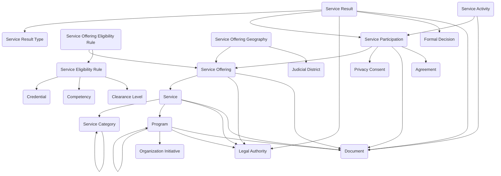

The **Programs and Services module** provides a structured framework for defining what an organization offers, configuring eligibility, tracking participation, and documenting service delivery outcomes. It separates strategic structure from eligibility configuration and operational execution, enabling consistent service design and delivery across contexts.

## Using the Module

Organizations can structure their offerings hierarchically starting with **Programs**, which represent high-level initiatives or policy areas under which services are offered. Programs can group related services and provide strategic, organizational, or funding context. Programs can reference organization initiatives, legal authorities, administering organization units, program managers, annual budgets, funding sources, effective dates, and policy documentation. Programs can establish hierarchical relationships to reflect parent-child program structures.

Within programs, **Services** can be defined to represent specific types of service provided. Services can describe what is offered in general terms, reference the parent program, link to legal authorities governing the service, be classified using **Service Categories** for reporting and organization, track service ownership and lifecycle status, and document service descriptions and supporting materials. Service categories can be organized hierarchically to support multi-level service classification taxonomies.

To make services available for enrollment, **Service Offerings** can be created to represent specific versions or configurations of a service, typically bounded by time, geography, or policy parameters. Service offerings can define concrete instances of a service that participants may enroll in, specify offering names, codes, and descriptions, track offering dates and availability windows, reference legal authorities and policy documents, manage offering status and lifecycle, and support versioning for service evolution over time.

Eligibility for service offerings can be configured through **Service Eligibility Rules**, which represent reusable eligibility conditions that may be applied to one or more offerings. Eligibility rules can define qualification criteria such as age ranges, income thresholds, residency requirements, employment status, clearance level requirements, competency or credential requirements, and other conditions. Rules can be linked to specific offerings through **Service Offering Eligibility Rules**, which define which eligibility rules apply to each offering and can specify whether rules are required or optional, set rule effective dates, and control evaluation sequences.

Geographic availability can be managed through **Service Offering Geography** records that define where an offering is available or valid by linking offerings to locations, judicial districts, or geographic service areas. This enables organizations to scope services to specific jurisdictions, regions, or delivery zones.

When individuals or organizations enroll in services, **Service Participation** records can be created to represent enrollment or engagement in a specific service offering. Participation records can anchor the lifecycle of engagement including participation status (active, pending, suspended, completed, withdrawn), enrollment dates and completion dates, eligibility determination results, assigned case managers or service coordinators, privacy consent references, and participation agreements.

During service delivery, **Service Activities** can be documented to track operational events or actions performed for a specific participation. Activities can record service delivery dates, activity types and descriptions, assigned staff, supporting documentation, and completion status. Activities can represent appointments, assessments, training sessions, consultations, interventions, or other operational milestones.

As services are delivered and decisions are made, **Service Results** can be created to capture official, factual outcomes that occurred for a specific participation. Results can document approvals, denials, issuances, adjustments, completions, or other auditable outcomes. Each result can reference a **Service Result Type** from a predefined set of allowable result classifications, record result dates and decision makers, link to formal decisions when required, reference legal authorities supporting the result, attach supporting documentation, and establish a historical record of what officially occurred. This integrated approach enables organizations to manage strategic program structure, operational service delivery, and verifiable outcomes within a unified framework suitable for benefits administration, grants management, community assistance programs, workforce initiatives, customer onboarding, subscription services, vendor programs, and training offerings.

