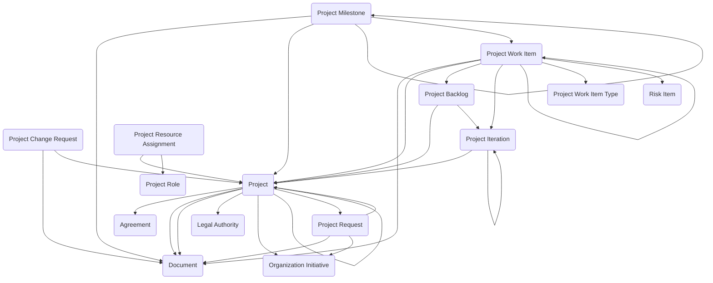

The **Project Tracking module** supports the structured intake, planning, execution, and control of work across initiatives of any size. It enables organizations to capture proposed work, formally manage approved projects, plan delivery using backlogs and iterations, and execute work through categorized work items aligned to defined roles and resource assignments.

## Using the Module

The project lifecycle typically begins when work is proposed through **Project Requests**, which represent intake records capturing initial business need, justification, high-level scope, and evaluation prior to formal project approval. Requests can document proposed project names and descriptions, reference organization initiatives providing strategic alignment, specify requesting organization units and requesters, track request dates and priorities, estimate proposed budgets and timelines, reference supporting documentation, and progress through review and approval workflows before transitioning to formal projects.

When a project request is approved, a **Project** can be created to serve as the primary delivery record for the defined body of work. Projects can document project codes, names, and descriptions, reference parent projects for hierarchical program structures, link to organization initiatives and legal authorities, specify project sponsors, business owners, and project managers, assign owning organization units and delivery organizations, track approved budgets, planned effort, and cost actuals, define baseline and actual start and end dates, monitor project status, health, and completion percentage, capture assumptions, constraints, and success criteria, reference project charters and supporting documentation, and link to agreements or contracts governing the work.

To support project execution, **Project Roles** can be defined to represent standardized roles used within projects such as Project Manager, Business Lead, Technical Lead, Developer, Tester, or Subject Matter Expert. Roles can support consistent staffing structures and reporting. **Project Resource Assignments** can then be created to assign persons or resources to projects, specifying the assigned role, allocation percentage, assignment start and end dates, planned effort hours, and optional assignment to specific work items or phases.

Projects can organize work through **Project Backlogs**, which represent planning containers that group and prioritize future work items before assignment to execution phases. Backlogs can be categorized by backlog type such as product backlog, sprint backlog, release backlog, or feature backlog, track backlog status and ownership, and link to specific iterations when work is pulled into execution. **Project Iterations** can represent defined timeboxes or execution cycles within a project such as sprints, phases, or increments. Iterations can specify iteration names and numbers, define start and end dates, link to parent backlogs, establish hierarchical relationships for nested iterations, track iteration goals and completion status, and organize work items scheduled for completion during the period.

Work execution can be managed through **Project Work Item Types**, which define categories of work items such as Epic, Feature, User Story, Task, Defect, or Change Request. Work item types can control classification, reporting, and workflow behavior. **Project Work Items** can then be created to represent core execution records for units of work within the project. Work items can reference their work item type, specify titles and descriptions, track work item status and priority, assign to persons or teams, estimate and record effort hours, define parent-child relationships for hierarchical decomposition, link to project backlogs and iterations, reference associated milestones, attach supporting documentation, and connect to risk items when work involves identified risks.

Projects can establish timeline checkpoints through **Project Milestones**, which represent significant events or delivery dates such as key deliverables, approvals, or completion markers. Milestones can document milestone names and descriptions, specify planned and actual dates, track milestone status and achievement, link to deliverable work items, establish hierarchical milestone relationships, and reference supporting documentation. When approved project baselines require modification, **Project Change Requests** can be created to formally propose changes to scope, schedule, cost, deliverables, or other baseline elements. Change requests can document change descriptions and justifications, assess impact on scope, schedule, and budget, track review and approval status, specify implementation dates, and reference supporting impact analysis documentation. This integrated approach enables organizations to manage IT implementations, policy initiatives, construction projects, product development, operational improvements, research programs, or any structured body of work requiring visibility, accountability, and controlled delivery from initiation through completion.

