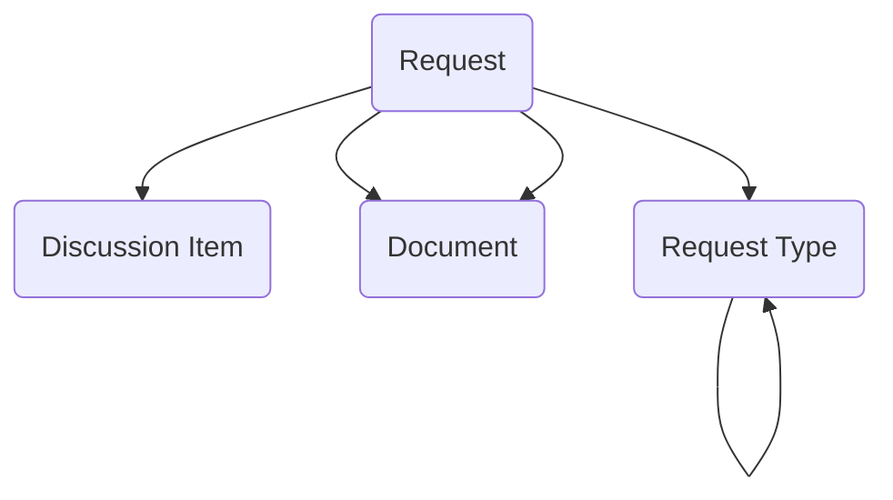

The **Request Tracker module** provides a lightweight, centralized system for teams or divisions to intake, triage, assign, and track cross-organizational or external requests. It serves as a flexible front door for handling data pulls, access requests, policy questions, document reviews, partner inquiries, leadership taskings, service coordination requests, or general assistance requests without the overhead of a full case management system.

## Using the Module

Organizations can configure request intake by defining **Request Types**, which classify requests and support consistent routing, prioritization, and reporting. Request types can specify type names and descriptions, establish hierarchical type relationships for categorization, define default routing rules and assigned organization units, set target completion timelines and service level expectations, configure priority levels and approval requirements, and control workflow behavior. Request types can provide the foundation for standardized intake processes across teams or divisions.

When requests are submitted, **Request** records can be created to track individual submissions from intake through completion and closure. Requests can capture request titles and detailed descriptions, reference the request type for classification and routing, identify the requester or contact person with contact information and contact preferences (email, phone, in-person), specify whether requests are internal or external, mark requests as confidential when required, track submission dates and due dates, handle assignment to organization units and assigned staff, monitor assignment dates and assignment authority, manage approval workflows with approver identification, approval status, approval dates, and approval notes, track completion by staff with completion dates, document effort hours expended, record closure by staff with closure dates and closure notes, capture requester feedback following completion, link to discussion items for threaded communication, attach supporting documentation with attachment descriptions, and progress through status lifecycle from submitted through assigned, in progress, completed, and closed.

Requests can establish connections to related work through links to action items, projects, cases, or other domain-specific records when the request triggers or relates to broader initiatives. The request origin (internal department, external partner, leadership, public inquiry) and priority can guide triage and routing decisions. Request tracking provides teams with visibility into workload, turnaround time, and completion metrics while maintaining a lightweight structure suitable for smaller teams that need accountability and reporting without complex case management overhead. As work complexity grows, requests can serve as the initial intake point before transitioning to specialized modules for formal investigation, project execution, or case management.

