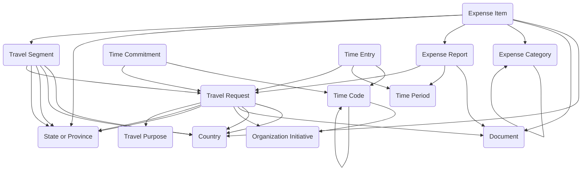

The **Time, Travel, and Expenses module** provides a unified structure for capturing time worked, planning personnel availability, authorizing travel, and submitting reimbursable expenses. It enables individuals to record time against standardized time codes, plan future availability, request and manage travel with detailed itineraries, and submit costs through categorized expense reports.

## Using the Module

Time tracking begins with defining **Time Periods** to establish reporting cycles such as weeks or pay periods, and **Time Codes** to create hierarchical classification structures for categorizing work types. Personnel can then record actual work through **Time Entries** that capture dates, hours worked, and time code classifications, while **Time Commitments** can be created to plan future availability or obligations for scheduling and duty assignments.

When travel is required, organizations can configure **Travel Purposes** for standardized trip reasons, then create **Travel Requests** to authorize and track trips with traveler identification, dates, destinations, estimated costs, and approval workflows. Detailed itineraries can be documented through **Travel Segments** representing individual trip components such as flights, lodging, or rental cars with departure/arrival details and cost estimates.

For expense management, **Expense Categories** can be defined with reimbursement rules, maximum amounts, and policy controls. Personnel submit **Expense Reports** grouping multiple **Expense Items** for review and approval. Expense items can reference categories, link to travel segments, attach receipts, and support mileage calculations. This integrated approach enables organizations to manage time tracking, travel authorization, and reimbursement processing within a unified framework.

