The **Training and Certification module** provides a comprehensive framework for managing learning delivery, academic programs, credentialing, and eligibility requirements. It supports defining training courses, organizing curricula through learning paths and academic programs, tracking enrollments and completions, awarding certificates with lifecycle management, and enforcing qualification requirements for roles, access privileges, or operational activities.

## Using the Module

Organizations can establish their learning catalog by defining **Training Courses** with descriptions, objectives, and credit values, along with **Training Course Requirements** for prerequisites. **Training Objectives** can document specific learning outcomes, while **Learning Paths** can organize curated sequences of courses toward specific skill sets, with **Learning Path Courses** managing course sequencing and requirement status.

Learning delivery operates through **Academic Terms** defining scheduling periods, **Training Sessions** representing scheduled class offerings within terms, and **Training Instructors** authorized to deliver sessions. Learners create **Training Enrollments** to register for sessions, with **Training Session Attendance** tracking participation. Upon completion, **Training Completions** document results, scores, and completion dates.

Certificate management leverages **Training Certificates** defining credentials with issuing authority and validity periods, **Training Certificate Requirements** specifying criteria to earn certificates, and **Training Certificate Achievements** representing awarded instances with expiration tracking. **Training Certificate Renewals** document renewal events and updated expiration dates for ongoing credential lifecycle management.

For formal academic programs, **Academic Programs** represent structured curricula such as degrees or diplomas, **Academic Program Requirements** define course, path, or credit requirements, and **Academic Program Completions** record individual completion status with final standing and honors recognition.

Organizations can enforce eligibility through **Qualification Requirements** defining reusable rule sets for roles, access, or activities, with **Qualification Requirement Items** specifying individual required courses, certificates, competencies, credentials, or clearance levels. This integrated approach enables university course management, corporate learning and development, professional certification programs, compliance-driven training, apprenticeship models, and readiness enforcement across enterprise operations.

```mermaid
graph TD
  appbase_AcademicProgram(Academic Program)
  appbase_AcademicProgramCompletion(Academic Program Completion)
  appbase_AcademicProgramRequirement(Academic Program Requirement)
  appbase_AcademicTerm(Academic Term)
  appbase_ClearanceLevel(Clearance Level)
  appbase_Competency(Competency)
  appbase_ComplianceFramework(Compliance Framework)
  appbase_LearningPath(Learning Path)
  appbase_LearningPathCourse(Learning Path Course)
  appbase_LegalAuthority(Legal Authority)
  appbase_QualificationRequirement(Qualification Requirement)
  appbase_QualificationRequirementItem(Qualification Requirement Item)
  appbase_TrainingCertificate(Training Certificate)
  appbase_TrainingCertificateAchievement(Training Certificate Achievement)
  appbase_TrainingCertificateRenewal(Training Certificate Renewal)
  appbase_TrainingCertificateRequirement(Training Certificate Requirement)
  appbase_TrainingCompletion(Training Completion)
  appbase_TrainingCourse(Training Course)
  appbase_TrainingCourseRequirement(Training Course Requirement)
  appbase_TrainingEnrollment(Training Enrollment)
  appbase_TrainingInstructor(Training Instructor)
  appbase_TrainingObjective(Training Objective)
  appbase_TrainingSession(Training Session)
  appbase_TrainingSessionAttendance(Training Session Attendance)
  credential(Credential)
  appbase_AcademicProgram --> appbase_AcademicProgram
  appbase_AcademicProgramCompletion --> appbase_AcademicProgram
  appbase_AcademicProgramRequirement --> appbase_AcademicProgram
  appbase_TrainingCompletion --> appbase_AcademicTerm
  appbase_TrainingSession --> appbase_AcademicTerm
  appbase_QualificationRequirementItem --> appbase_ClearanceLevel
  appbase_QualificationRequirementItem --> appbase_Competency
  appbase_TrainingCertificateRequirement --> appbase_Competency
  appbase_TrainingCourseRequirement --> appbase_Competency
  appbase_TrainingObjective --> appbase_Competency
  appbase_QualificationRequirement --> appbase_ComplianceFramework
  appbase_TrainingCertificate --> appbase_ComplianceFramework
  appbase_AcademicProgramRequirement --> appbase_LearningPath
  appbase_LearningPath --> appbase_LearningPath
  appbase_LearningPathCourse --> appbase_LearningPath
  appbase_QualificationRequirementItem --> appbase_LearningPath
  appbase_TrainingCertificateRequirement --> appbase_LearningPath
  appbase_TrainingCourseRequirement --> appbase_LearningPath
  appbase_QualificationRequirement --> appbase_LegalAuthority
  appbase_TrainingCertificate --> appbase_LegalAuthority
  appbase_QualificationRequirementItem --> appbase_QualificationRequirement
  appbase_QualificationRequirementItem --> appbase_TrainingCertificate
  appbase_TrainingCertificateAchievement --> appbase_TrainingCertificate
  appbase_TrainingCertificateRequirement --> appbase_TrainingCertificate
  appbase_TrainingCourseRequirement --> appbase_TrainingCertificate
  appbase_TrainingCertificateRenewal --> appbase_TrainingCertificateAchievement
  appbase_TrainingCertificateAchievement --> appbase_TrainingCompletion
  appbase_AcademicProgramRequirement --> appbase_TrainingCourse
  appbase_LearningPathCourse --> appbase_TrainingCourse
  appbase_QualificationRequirementItem --> appbase_TrainingCourse
  appbase_TrainingCertificateRequirement --> appbase_TrainingCourse
  appbase_TrainingCompletion --> appbase_TrainingCourse
  appbase_TrainingCourse --> appbase_TrainingCourse
  appbase_TrainingCourseRequirement --> appbase_TrainingCourse
  appbase_TrainingCourseRequirement --> appbase_TrainingCourse
  appbase_TrainingObjective --> appbase_TrainingCourse
  appbase_TrainingSession --> appbase_TrainingCourse
  appbase_TrainingCompletion --> appbase_TrainingEnrollment
  appbase_TrainingSessionAttendance --> appbase_TrainingEnrollment
  appbase_TrainingCompletion --> appbase_TrainingInstructor
  appbase_TrainingSession --> appbase_TrainingInstructor
  appbase_TrainingSession --> appbase_TrainingInstructor
  appbase_TrainingEnrollment --> appbase_TrainingSession
  appbase_QualificationRequirementItem --> credential
  appbase_TrainingCertificate --> credential
  appbase_TrainingCertificateRequirement --> credential
  appbase_TrainingCourseRequirement --> credential
```

